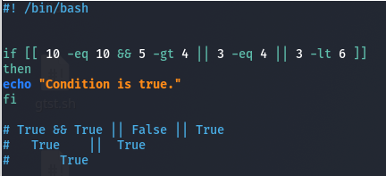

# Introduction to BASH scripting

## What is Bash Script?

- **Bash = Bourne Again Shell**
- It is a shell, that used to interact with your kernel.

## What is Script?

- **Script** is a file that contains shell commands in a simple and clear algorithm. 
- The original is sh - Bourne shell.

### uses of bash

- Script development
- Automating tasks
- Simplifying your linux ability
- Developing hacking scripts.

# Starting with Bash

- Bash files can have **“.sh”** extension but you can have it without **‘.sh’** too
- The file have to have executable Permissions.
- You can use any text editors u need: *VIM,nano,VScode,gedit,cherrytree*…

## Displaying output

- To start Every bash scripts use shebang.
    - **#! /bin/bash**
    - **#! /bin/sh**
- To display outputs on bash you just do 
    - **echo “YOUR TEXT HERE”**
- To run your project you can do:
    - **/bin/bash hello.sh**
    - **./hello.sh**   -->  need x

- If you need to add new lines on your code just add **echo**.

## Variables

- Bash Variables are same with python variables, with some exceptions.
- *Syntax:* ====> **VARIABLE_NAME=value**
- Exceptions:
    1. NO Space between the equal sign ( = )
    2. NAME  =  “Nathan”   => ERROR
    3. NAME=”Nathan”  =>  Correct.
    4. Never Start with Numbers
    5. USE double quotes only.
- To use the variable we will use *dollar sign*( $ )  before the Variable name
- If you want to display the variable sticked with other text use ${VARIABLE_NAME}
- Bash Variables are **string** by default.

```bash
#! /bin/bash

name="Amanuel"
num=10

echo "My name is $name, and I'm learning Day${num}class."
# Output ==> My name is Amanuel, I'm learning Day10class.
```

- The set command can be used to assign values to positional parameters.
- *Syntax:* ==> **set value1 value2 value3 value4 value5**

```bash
#! /bin/bash
set Amanuel Abay Workie Mera Teklu Beyene
  #    $1    $2     $3   $4    $5    $6

echo $1 $2 $3
# Amanuel Abay Workie
```

# System Variables 

- Are variables those are declared by the system.

```bash
#! /bin/bash

echo $BASH
echo $BASH_VERSION
echo $PWD
echo $HOME
echo $PATH
echo $USER
```

- There are so many: LANG, TERM,MAIL,EDITOR,USER,SHELL….
- **USER** displays Computer owner(host)

## Variables & Data Types

- As we saw, the previous method they create strings only.
- So to create other data types we use declare.

### Arrays

- **Arrays** are lists or tuples on python.
- *Syntax:* ===> **var=(“list1” “list2” “list3” “list4)**
    1. TO display echo 
        - **${var[0]}**
    2. To get all the elements 
        - **${var[@]}**
    3. To get the indexes 
        - **${!var[@]}**
    4. To get the length 
        - **${#var[@]}**
    5. To add element to the array 
        - **var[4]=”list5”**
    6. To remove from the array 
        - unset var[3]

- 5 and 6 are write without **echo**.

# Bash Input

- On bash we have 2 methods to accept input
    1. Read function
    2. Arguments

1. **Bash read**

- Read used to accept inputs while the script is running.
- *Syntax*:
    - **read -p “Text To Display” var**
    - **read -sp “Password: ” var**  =>   used to accept hidden texts like password.
    - **read -a var**  =>   for accepting arrays(lists)

```bash
#! /bin/bash

read -p "text" var_name
read -sp "password" var_pass
read -a var_array

echo "first is: ${var_array[0]}"
echo "second is: ${var_array[1]}"
echo "third is: ${var_array[2]}"
```

2. **Arguments**

- These helps to get input before the script starts
- *Syntax:*
    - Just use $0-$9 while you want to work with the input

```bash
#! /bin/bash

echo "your name is: $1"
echo "your age is: $2"
```

## Comments

```bash
#! /bin/bash

# In bash this Hashtag is used to comment in only one line.

# for multi comments we use the <<"COMMENTS" name and at the final we type COMMENTS
# For example
<<COMMENTS
echo "This is used to multi comments."
COMMENTS
```

### Bash sleep

- Sleep used to make a good waiting on our script.
- *Syntax:* ===>  **sleep <number>s**

# Operation

- To do mathematical operations you have to do $(( expression ))
- we will use let keyword for assigning variable

1. Arithmetic Operations
    1. Addition **$(( a + b ))**
    2. Subtraction **$(( a - b ))**
    3. Multiplication **$(( a * b ))**
    4. Division **$(( a / b ))**
    5. Exponential **$(( a ** b ))**
    6. Modulo **$(( a % b ))**
2. Assignment Operations  
    1. Increment  **“let a+= 3”**
    2. Decrement  **“ let a-= 3”**
    3. Multiply **“ let a*= 3  “**
    4. Divide  **“ let  a/=3 “**
3. Comparison operation

- **Alphabetic comparison**
    1. Greater Than =>  **-gt**
    2. Less Than => **-lt**
    3. Greater than and equals to => **-ge**
    4. Less than and equals too  =>  **-le**
    5. Equal  =>  **-eq**
    6. Not equal  => **-ne**
- Sign comparison
    1. >
    2. <
    3. >=
    4. <=
    5. =
    6. !=

## If else conditions

```bash
#! /bin/bash

if [condition];then
    # anything you can write here
else
    # anything you can write here
fi
```

- If you used **[ condition ]**  => you will use *alphabetic* comparison
- But for **strings** you can use *sign* too

```bash
#! /bin/bash

if [ 2 -gt 1 ];then
    echo "true"
else
    echo "False"
fi
```

```bash
#! /bin/bash

if (( 2 > 1 ));then
    echo "True"
else
    echo "False"
fi
```

