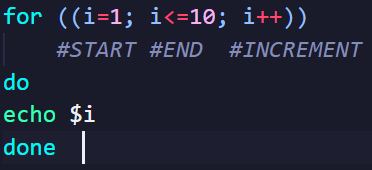
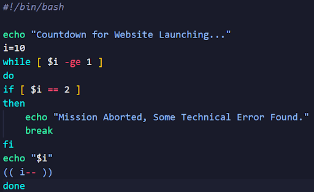
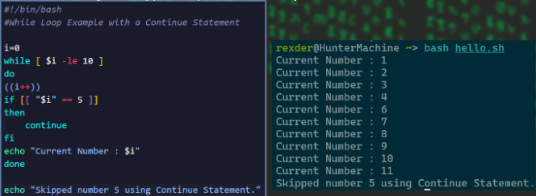
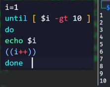
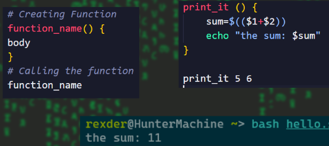
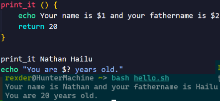

# Regular Expressions! /regex/

- Most filter Validation on any platform done by **Regular expression/regex/**.
- They are patterns that helps to filter so texts,space,tabs & symbols.
- Like telegram or other platforms filtering links inside group, filtering some bad words.. All are regex.
- **Regex** is PATTERN!
- **Regex** are used on linux tools called grep,awk and sed

- The pattern is same but the implementation may differ on programming languages.
- On Python,

```python
import re

a = re.search("PATTERN", "SEARCHING FILE").group(0)
# regex in python
print(a)
```

## Metacharacters 

- Those are regex pattern symbols for filter.
- They are :
    1. .
    2. ^
    3. $
    4. *
    5. +
    6. ?
    7. { }
    8. [ ]
    9. ( )
    10. |
    11. \

1. **Dot ( . )**

- Used to get All the line except new lines
- *Syntax:* ==>  **.**
- This means give me all lines except the new lines.

2. **Caret ( ^ ) - Assertion**

- Used to get line that start with pattern
- *Syntax*: ==>  **^hello**
- This means lines that start with hello

3. **Dollar sign( $ ) - Assertion**  

- Used to get line that ends with some pattern.
- *Syntax*: ==> **hello$**
- That ends with hello

4. Plus ( + )  -  Quantity  

- Used to get line that have pattern that occurs 1 and more times.
- *Syntax*: ===> **hellos+**
- A text hello that have s at least 1 times and more.

5. Asteriks ( * )  -  Quantity  

- Used to get line that have pattern that occurs 0 and more times.
- *Syntax*: ===> hellos*
- A text hello that have s at least 0 times and more.

6. Question mark ( ? )  -  Quantity  

- Used to get line that have pattern that occurs 0 and 1 times.
- *Syntax*:  ===> **hellos?**
- A text hello that have s at least 0 time or 1 time.

7. Curly Bracket ( { min , max} ) - Quantity

- Used to get line that have pattern that occurs min and max times.it is custom
- *Syntax*: ===> **hellos{1,3}**
- A text hello that have s at least 0 times and more.
    1. {1,} = plus sign
    2. {0,} = asterisk
    3. {0,1} = Question mark

## \w

- **\w** is Used to get Alphanumeric.
- All texts except newlines and symbols

## \s

- Used to get whitespace.
- All spaces and tabs.

## \d

- Used to get Digits/numbers/.

8. Pipe ( | ) - OR

- Used to search 2 different things.
- *Syntax*: ===>  **a|b**

9. Escape ( \ ) 

- Used to search symbols that are metacharacters.
- *Syntax*: ===>  **\sign**

10. Square Brackets ( [ ] ) - Custom pattern

- Used to Create your own patterns
- *Syntax*: ===> **[]** 
    - example: [a-z]

# Bash regex

- You can use it on awk, sed, but for today I will show you using grep.
- On bash terminal these metacharacters have meaning so, we have to escape them by adding ‘\’ infront of the metacharacters.

# BASH FOR REGEX

- We use **=~** operator for regex check with if condition statements
- Here we use double Brackets for our conditional Statements.
- *SYNTAX*:

```bash
#! /bin/bash

pattern="your-regex"
if [[$input =~ ${pattern}]]
```

```bash
#! /bin/bash

read -p "Enter a number: " num

pattern="[0-9]"
if [[$num =~ ${pattern}]];then
    echo "Good number"
else
    echo "Please enter number only."
fi 
```

## Bash else if

- To do more than 1 comparing.
- It is same with python is is “elif”
- Syntax: 

```bash
#! /bin/bash

if [condition]
then 
    body
elif [condition]
then
    body
else
    body
fi
```

### Loops

- On Bash, there are 3 types of loops
    1. For loop
    2. While loop
    3. Until loop

1. For loops

- The iteration may be different here. We can use arrays like list on python but we dont have range in bash but we can do {a..b}  this iterates from a to b
- *Syntax*:

```bash
#! /bin/bash
for condition
do
    body
done
```

- *example*

```bash
#! /bin/bash
for num in {1..10}
do
    echo $num
done
# then the output is 1-10.
```



- On bash
   1. i++ = i +=1
   2.  i-- = i -= 1

## For Loop with increment/decrement

- Same syntax with index slicing but here it is for looping.  -  **{start..stop..step}**

```bash
for num in {1..10..1}
do
    echo $num
done
```

2. While loop

```bash
#! /bin/bash

while [ expression ]
do
    body
done

# lets see an example

read -p "Enter a number: " fnum
read -p "Enter second number: " snum

while [[ $fnum -le $snum ]]
do 
    echo $fnum
    ((fnum++))
done
```

### Infinite loop

```bash
#! /bin/bash

while [ expression ]
do
    body
done
# let's see an example

while :
do
    echo "Hello world"
done
```

#### Break Statement



#### Continue Statement

- Is A function that helps to break the loop there and start if from the up again. - its python equivalent is called ‘pass’.


3. Until loop

- It is same but this one exits the loop when the expression is true.

```bash
#! /bin/bash

until [ expression ]
do
    body
done
```



## Function



- When you have function and the arguments will be $1, $2 ….
- If we use **$?** it will call the return value.


### BASH and Linux

- We can run linux commands inside our bash.
- You can run bash codes in 1 line.

```bash
#! /bin/bash

for i in {1..5} do echo "Hello $i" done
```

- You can access files in current directory using * sign.

```bash
#! /bin/bash

echo *
```

### Interaction with linux

- You can interact with linux terminal using bash.
- For this our codes are bash so, your terminal have to be on bash
- in Command: **/bin/bash**

