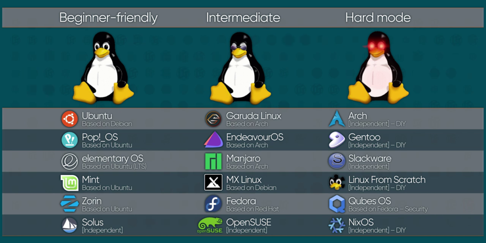

# introduction of Linux
# Linux
- *Linux* is **kernel** and it is open source.
- **Kernel** is a code that used to meet software and hardware.
- The person called *"Linus Torvalds"* created the Linux kernel.
- Linux was built by the C program language.
- *Richard Stallman* announced the **GNU** project in 1983 & cofounded the free software foundation in 1985.
- **GNU** is a free software replacement to the UNIX OS, but it was just software replacement not full OS.

---

**GNU + Linux = GNU/Linux OS**

---

# Shell
- user communicate with the kernel by the **Shell**.
- **Shell** is a command line interpreter. It translate commands entered by the user & converts them into a languages that is understood by the kernel.
## Some Types of Shell
1. Bash
2. zsh
3. sh
4. Fish
5. csh

# Operating system(OS)
- **OS** means the main software part of the computer that helps to work on.
    --> It contain:
                   - Kernel
                   - Software
                   - Desktop Environment
                   - File extensions
                   - Windows manager
### Some Types of Desktop Environment in Linux
1. mate
2. gnome
3. KDE plasma
4. XFCE

### *Why people choose Linux*
- have more hacking tools.
- most secured, b/c it is open source.

## Linux distribution/distro
- distro is modified Linux kernels.
- Types of OS with different :
                              - Linux kernel
                              - Packages(GNU)
                              - Package manager
                              - Desktop UI
---                              

- [[image.png]]

---
## **Kali Linux**
- is a Debian-Linux distribution designed for *digital forensics* & *Penetration testing*.
    a. Desktop Environment = **XFCE**
    b. package manager = **apt**
    c. shell = **zsh**
---
## **Parrot**
- is a Linux distribution based on Debian with a focus on the *security*, *privacy & development*.
    a. Desktop Environment = **mate**
    b. package manager = **apt**
    c. shell = **bash**
---
## **Garuda**
- is a Linux distribution based on the Arch Linux OS.
    a. Desktop Environment = **plasma**
    b. package manager = **pacman**
    c. shell = **fish**
---

# Downloading Linux method
1. main boot/main OS
2. Dual boot/2 in 1
3. Live boot
4. Cloud terminals
5. WSL (windows subsystem for Linux)
6. Virtual machine
7. Termux/Android