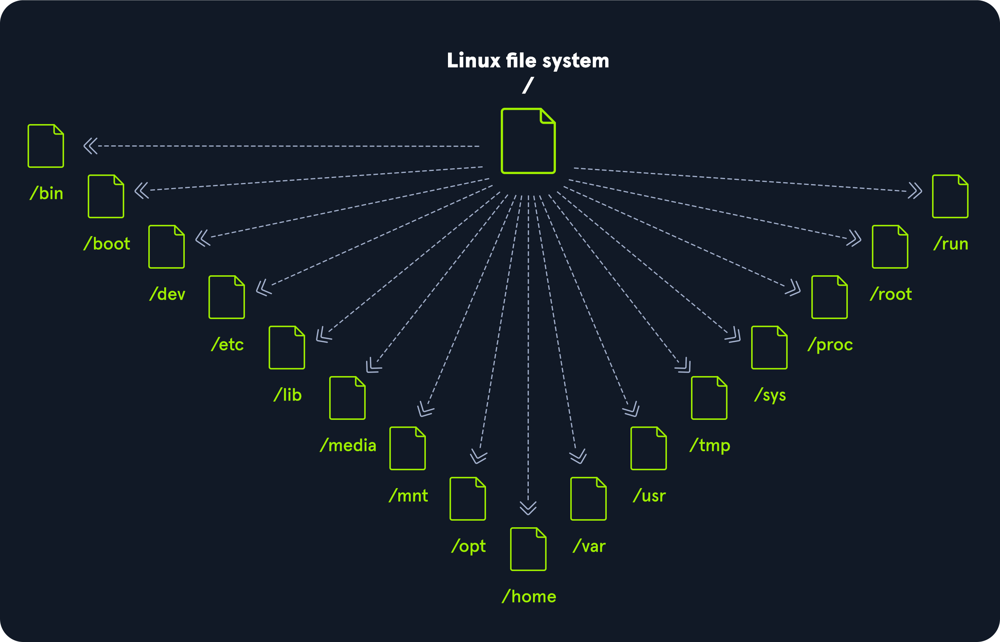

# Linux file Hierarchy(system)
- Linux have a special file system than windows.
- **file system** is a directory structure that the OS user.
- **system files** are files used by the system software(OS).
- **windows** appear under the *local disk C:*.
- **Linux system** appear under the root directory(/).

---

---
## 1. /(root)
- is the root user's home directory, which is not the same as /.
- The only root user has the right to write under this directory.

## 2. /bin(binary executables)
- Essential command binaries that need to be available in single-user mode; for all users.

## 3. /boot(boot loader files)
- contains of static boot loader, kernel executable & file required to boot the Linux OS.
- kernel initrd, vmlinux, grub files ar located under /boot.

## 4. /dev(Essential device files)
- contains terminal devices, usb or any device attached to the system (every hardware device attached to the system).

## 5. /etc(et cetera)
- contains configuration files required by all programs.
- also contains startup & shutdown shell scripts used to start/stop individual programs.
- local system configuration files for installed applications may be saved here as well.

## 6. /home
- used to for all user to store their personal files.

## 7. /lib(libraries)
- shared libraries files that are required for system boot.

## 8. /media
- external removable media devices such as USB drives are mounted here.

## 9. /mnt(temporaries mounted files)
- temporary mount directory where sysetem admins can mount file systems.

## 10. /opt(optional application software packages)
- optional files such as third-party tools can be saved here.

## 11. /sbin(Essential system binaries)
- contains executables used for system administration.

## 12. /tmp(temporary files)
- contains temporary files created by the system and users.
- Generally, cleared upon system boot and maybe deleted without any warning.

## 13. /usr(user)
- contain executables, libraries, man files.

## 14. /var(variable)
- contain variable data files such as log files, email in-boxes, web application related files, cron files and more.

---

---

# Text editors
- is programs that used for text processing.
- Linux command line text editors.
    - Vim
    - Nano
    - Emacs
    - Neovim, etc...
- Linux graphical text editors.
    - sublime
    - Vscode
    - Gedit
    - pluma, etc...

# vim
- before vi the primary editor used on UNIX was the line editor.
- user was able to see/edit only one line of the text at a time.
- Then vi editor improved and developed Vim(vi improve).
- The vim editor is 
    - a very powerful.
    - but at the same time it is cryptic.
    - it is hard to learn, specially for windows
- It have mainly two(2) modes:
    - command mode (Esc) ---> where you can do commands
    - Insert mode (i) ---> where you can write
- inside the command mode
        - save = :w
        - Quit = :q
        - force quit = :wq!
        - undo = :undo(u)
        - command = :%!yourcommand

# Nano
- **GNU nano** is a free and open-source text editor that usually comes pre-installed in Linux system.

### shortcut of nano
        - ^ = ctrl
        - ^ + s = save
        - ^ + x = exit
        - alt + u = undo
        - alt + e = redo

# Linux user management
- on computer system, person who uses the computer is called **"user"**.
- every user have Group and their own file and applications.
- Those user have a power.
- on Linux there's 2 kinds users.
    1. Root id = 0
    2. normal user id = 1-999
- The root user have the power to do everything on Linux.

# creating user
- to create users you can the following commands.
    - useradd ---> Simple -----> sudo useradd -m "username"
    - adduser ---> Detailed ----> sudo adduser "username"
- The user files are stored inside **/etc/passwd**.
- The user password are stored inside **/etc/shadow**.