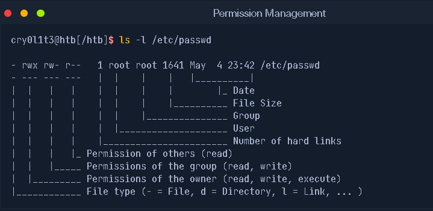
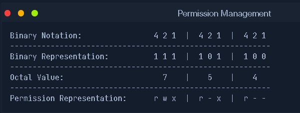

# **Some advanced user commands**
1. - To change password of the user
        - sudo passwd username
2. - To change user-id(UID) 
        - sudo usermod -u "new-id" username
3. - To delete user
        - sudo userdel -r username
4. - To change users on terminal
        - su - username
5. - To create a home directory to users
        - sudo mkdir /home/username
        - sudo useradd -m username
6. - To change the shell of the user
        - sudo usermod username -s /bin/bash
        - sudo chsh username --shell /bin/sh
        - nano /etc/passwd
# Sudoers file
- **Sudoers file** is a file Linux & Unix administrators use to allocate system rights to system users.
- The user you created doesn't have power to use **sudo** as the original one, Because it isn't added in the sudoers file.
1. - To access this sudoers file, Then change the user privilege
        - sudo visudo

# Linux file permission
- Every file on linux have their 
    - owner
    - permission
- There is 5 main parts on the listing
    1. Permission
    2. Owner
    3. Date
    4. size
    5. filename

# Ownership
- **ownership** is the owner of the files.
- This have 2 kinds
    1. owner
    2. Group
- To change the user file
    - sudo chown user filename
- To change both user(owner) and group
    - sudo chown user:group filename

# Permission
- There are three types of Permission.
    1. Read(r)
    2. Write(w)
    3. Execute(x)
- The folder & files are differ with the 'd' & '-' on the beginning of the permission.
- There still the permission have 3 parts.
    - **user-group-other**
1. **user** is a power of user defined on the ownership.
2. **Group** is a power of group defined on the ownership.
3. **other** is a power of other users.
4. **All** is a power of all which can be founded in the 3 above owners.

- command to change permission of the file
    - sudo chmod "option" filename
    - sudo chmod +(x,w,r) filename
    - sudo chmod -(x,w,r) filename
- Each of the permission have a number representation
    - Read = 4
    - Write = 2
    - Execute = 1

 ---

 # **sudo chmod "parameter" filename**

 ---

- The parameter can be in numbers and symbols.
1. parameter in symbols
    - chmod a+x filename ---> add execute for all.
    - chmod u+x filename ---> add   >>    for user.
    - chmod g+x filename ---> add   >>    for group.
    - chmod o+x filename ---> add    >>   for other.
    - chmod -x filename ----> remove   >>  from all.
    - chmod a+rwx filename ----> add read, write and execute for all.
    - chmod u-rw filename ---> remove read and write from user.
    - chmod a+rwx,u-rw,g-x,o-xw filename ----> add **rwx** for all and remove something from all.
2. parameter in numbers
    - chmod 621 filename ---> 6 for user, 2 for group & 1 for other
        --> 6 = 4 + 2 = r + w = **rw=6**
    - chmod 777 filename --->  7 for user, 7 for group & 7 for other
        --> 7 = 4 + 2 + 1 = r+w+x = **rwx=7**
    - chmod 632 filename --->  6 for user, 3 for group & 2 for other
        --> 6 = 4+2 = r+w = **rw=6**
        --> 3 = 2+1 = w+x = **wx=3**

# **Spical file permissions**

- There are three special permissions.
1. **SUID bits(s)**-set user id bit - add 4 infront of our numeric value.
2. **SGID bits(S)**-set group id bit - add 2 infront of our numeric value.
3. **Sticky bits(t)**-set others id bit - add 1 infront of numeric value.
- Example:
    - sudo chmod u+sx filename

- There are permission like execute(x), but they will set the execute permission to the user who settled them.

# Package installation on linux
- on Linux to install software you use package managers like "apt,pacman,pkg".
- on Debian the package manager is called **"apt"** also known **"dpkg"**.
- Package manager is a free-software user interface that work with an online server to handle the installation and removal of software on Debian.

# Advanced package tools(apt)
- **apt** is free-software user interface that work with an online server to handle the installation & removal of software on Debian.
- The old 'apt' used as 'apt-get'
- syntax
    - sudo apt update 
    - sudo apt search software
    - sudo apt install software
    - sudo apt remove software
    - sudo apt upgrade software
    - sudo apt purge software

# Package dependencies
- a software can be built based on another program called 'modules'.
- so, a program to work properly, the dependencies have to be installed successfully.
# Dpkg(Debian package manager)
- Dpkg is an offline package managing program.
- packages on debian have an extension ".deb".
- syntax
    - sudo dpkg -i packagename
    - sudo dpkg -r    >>
    - sudo dpkg -p    >>