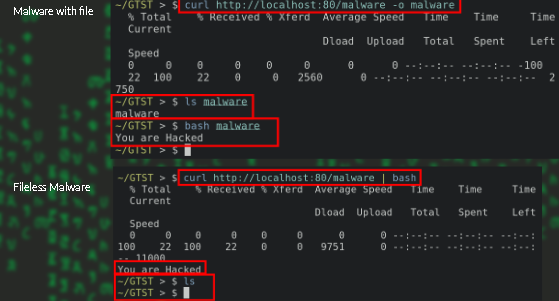
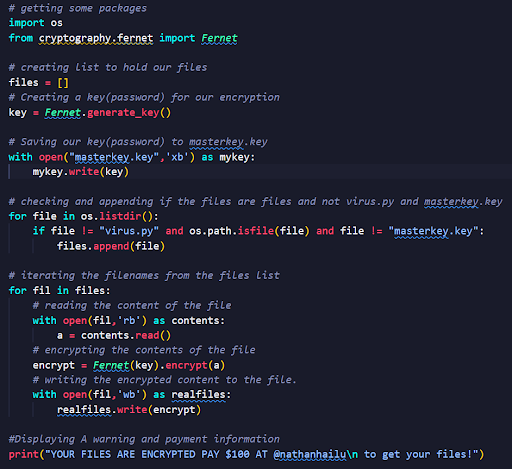
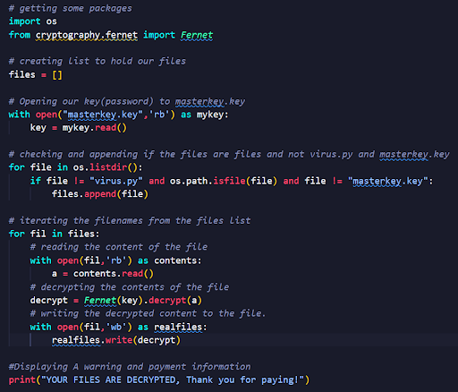

# malware Threats

## malware

- **malware** is set of instruction(program) that run on your computer and make your system do  something that an attacker wahts it to do.
- The name **Malware** come from 
    - **Malicious** => bad thing
    - **Software** => set of instruction(program).
- malware do this things:
    - removing files
    - Encrypting files
    - Corrupting files
    - Stealing files
    - Spying on user, ...

### Kinds of malware

1. Trojan
2. worm
3. Virus
4. Ransomware
5. Rootkit
6. Adware, ...

1. **Trojan**

- Trojan is a type of malicious code or software that looks legitimate but can take control of your computer.
- A Trojan is designed to damage, disrupt, steal, or in general inflict some other harmful action on your data or network.
- They don’t replicate.
- The name Trojan came from the Greek mythology Trojan Horse.
- Trojans will looks normal or legit software and then BOOM!

## common types of trojan

1. Backdoor Trojan

- This Trojan can create a back door on your computer. It lets an attacker access your computer and control it. 
- Your data can be downloaded by a third party and stolen. Or more malware can be uploaded to your device.

2. Mailfinder Trojan

- This Trojan seeks to steal the email addresses you’ve accumulated on your device.

3. Remote Access Trojan

- This Trojan can give an attacker full control over your computer via a remote network connection. Its uses include stealing your information or spying on you.
    - **C2 Servers(Command and Control):** This is a server which the malware communicate with, to pass commands to the malware also to have control over the malware to send and receive data.

4. Trojan banker

- This Trojan takes aim at your financial accounts.
- It’s designed to steal your account information for all the things you do online. That includes banking, credit card, and bill pay data.

2. **Worm**

- A computer worm can propagate or self-replicate from one computer to another without human interaction after breaching a system.
- Typically, a worm spreads across a network through your LAN (Local Area Network) connection.
- Damages files on the system including the system.

3. **Virus**

- They are the older and famous ones
- Virus is a program written to get to your computer and damage/alter your files/data.
- A virus might corrupt or delete data on your computer.
- Viruses can also replicate themselves.
- A computer Virus is more dangerous makes changes or deletes your files.

## Common signs of virus infection

- Speed of System
- Pop-up windows
- Self-executing
- Account being log out
- Crashing of device
- Mass emails being sent from you
- Files and system settings are altered.

### Common types of virus

- There are several types of computer viruses that can infect devices.
    1. Resident Virus
        - Viruses propagate themselves by infecting applications on a host computer. A resident virus achieves this by infecting applications as they are opened by a user.
        - A non-resident virus is capable of infecting executable files when programs are not running.
    2. Multipartite Virus
        - A multipartite virus uses multiple methods to infect and spread across computers. It will typically remain in the computer’s memory to infect the hard disk, then spread through and infect more drives by altering the content of applications. This results in performance lag and application memory running low. 
    3. Browser Hijacker
        - A browser hijacker manually changes the settings of web browsers, such as replacing the homepage, editing the new tab page, and changing the default search engine. Technically, it is not a virus because it cannot infect files.

4. **Ransomware**

- *Ransomware* is malware that employs encryption to hold a victim’s information at ransom. 
- A user or organization’s critical data is encrypted so that they cannot access files, databases, or applications.
- A ransom is then demanded to provide access.
- *Ransomware* is often designed to spread across a network and target database and file servers, and can thus quickly paralyze an entire organization.
- Ransomware =>   RANSOM +   SOFTWARE

5. **Rootkit**

- A **rootkit** is a type of malicious software designed to gain unauthorized root or administrator-level access to a computer system while concealing its presence and the presence of other malware.
- Rootkits allow attackers to maintain persistent control over a system, evade detection by security software, and perform various malicious activities.

6. **Bootnet**

- A type of malware that infects multiple devices (often called bots or zombies), enabling a hacker (known as a botmaster) to control those devices remotely from a single command-and-control server.
- These infected devices can be computers, servers, IoT devices, or smartphones. 
- Botnets are typically used for malicious activities such as launching distributed denial-of-service (DDoS) attacks, sending spam emails, stealing data, or performing other cybercrimes.

#### Infection techniques

1. USB drop attack
2. spam emails
3. malicious Office macros
4. software from unsafe website
5. using cracked software
6. malicious Browser extension

## Anti-virus(AV) software

- **Antivirus software** is a security tool designed to detect, prevent, and remove malicious software (malware) such as viruses, worms, Trojans, ransomware, and more.
- The Antivirus Used Different Method to detect the Malware:
    - **Signature-Based Detection**
    - **Heuristic-Based Detection**
    - **Sandboxing**

1. Signature-based Detection

- The antivirus software checks files against a database of known malware signatures (patterns unique to specific malware). If a match is found, the file is flagged as malicious.
- Ineffective against new or modified malware (zero-day threats), Means UPDATE is MUST!!!

2. Heuristic-Based Detection

- Analyzes the behavior of programs to identify suspicious activities that could indicate the presence of malware.
- Even if the exact signature isn't in the database, abnormal behavior (e.g., modifying system files, connecting to known malicious domains,unauthorized data access) may trigger an alert.
- This May produce false positives by flagging legitimate software as suspicious.

3. sandbox

- Runs suspicious programs in a controlled, isolated environment (a sandbox) to observe their behavior without affecting the system.
- If the program exhibits malicious behavior in the sandbox, it is flagged as malware.

### Anti-Virus(AV) Evasion techniques

- There are some Techniques to Evade/Not Being Detected by AV
    1. Packers
        - A packer is a program that compresses an executable to make it smaller.
        - It wraps the compressed executable in the code necessary to decompress itself at runtime.
        - Packing changes this the binary patterns and some hashes(we will learn on Day5 class) , so the AV may not detect the packed file.
    2. Crypters/encoders
        - The crypter encrypts the original executable using an encryption algorithm — often something as simple as a XOR cipher with a unique key.
        - Like a packer, its goal is to change the binary fingerprint of a file to avoid detection.
    3. Polymorphic malware
        - Polymorphic malware changes its code with each infection, making each instance of the malware unique.
        - This helps it evade signature-based detection, as there is no consistent pattern for the antivirus to recognize.
    4. Downloaders And Droppers
        - Many kinds of malware use programs called droppers or downloaders to learn about a system before installing the real malware.
        - Some of these droppers scope out a system first to avoid triggering security alerts when they download and install the real payload.
    5. Fileless Malware
        - Fileless malware operates entirely in memory, without writing any files to disk.
        - Since traditional antivirus software often focuses on scanning files, fileless malware can evade detection by avoiding the file system altogether.
        

#### Malware prevention

1. Install anti-virus and anti-spyware software.
    1. Example: kaspersky,avg,smadav
2. Use secure authentication methods.
    1. 2-factor authentication
    2. Implement email security and spam protection
3. Keep software updated
4. Use the least-privilege model.
5. Monitor for suspicious activity
6. Educate your users

#### Malware in history

- Lets see some malwares happened in history:

1. **Morris Worm**: Also known as the Internet worm, this was one of the first computer worms to spread via the Internet and earn notoriety in the media.
2. **ILOVEYOU**: The virus infected tens of millions of computers globally, resulting in billions of dollars in damage.
3. **Stuxnet**: Some experts believe this sophisticated worm was developed for years to launch a cyberattack.
4. **WannaCry**: is a ransomware which targeted computers running the Microsoft Windows operating system by encrypting (locking) data and demanding ransom payments in the Bitcoin cryptocurrency.

#### Python for malware development

- As we saw malwares do so many things and we can develop that malware based on the algorithm, We need.
- First we have to understand what our malware have to do.
- There are so many kinds of malware purpose
    - Delete files
    - Encrypt files
    - Corrupt files, ...
- Then You can Convert your python file to executable(exe) by py2exe technics.

##### Malware #1 File deleting malware

- The algorithm is simple
- When it load the program will delete files
- The file being deleted is based on our plan, but if the file needs root access then we need to build the rootkit too.
- Make sure you run them in the right test folder.
And go to that folder on your terminal/powershell.

##### File Handling in python

- Files are names locations on disk to store related information.
- Files Used to Store Data in Storage Devices.
- When we want to read from or write to a file, 
    - we need to open it.
    - And also when we are done we will close it.
- In Python ,a File Operation takes place in the following order:
    - Open a File
    - Read or Write(perform operation)
    - Close the file
- Python has a built-in function called open().
- Syntax:
    - with open(“fileName or filePath”,’x’) as var
- Modes:
    - write-----------------w
    - read------------------r
    - append----------------a
    - Create--------------- x
    - text mode-------------t
    - binary mode-----------b
- Example:
    - with open(“fileName”,’w’) as var:
    - with open(“fileName”,’rt’) as var:-> rt ~ r         --text mode is default

##### Write on files

- in order to write on file we have to open it in write, append, creation mode.
- Warning: Be sure when you use ‘w’ because it will overwrite the existing file. SO use Append ‘a’
- Syntax: 
    - var.write(“Hello world”)

```python
with open("notes.txt",'w') as aman:
    aman.write("hello,this is my note.")
```

##### Reading a file

- To read files on python we have to open it by reading mode ’r’
- There are many methods for this. But, we can use the read 
    - **read()** - >This read file up to the inputted size number.BUT if you don’t add the size it will read it until the end.
    - **readline()** -> To read files only one line
    - **readlines()** -> reads all file in 1 line
- Syntax:
    - var.read(5)
    - var.readline()
    - var.readlines()

##### Creating file

- You just need to add the x on the type.
- But be sure if the file exists there will be File exists error.

##### 

- To check if the file is created before:

```python
import os 
if os.path.exists(“filename”):
    print(“the file already exist!”)
else:
    print(“no file!”)
```

##### Malware #2 File Ransomware

- Here we are going to do our own ransomware.
- So how do ransomware words…. Algorithm?
    - They scan the system files
    - They will encrypt them with some key
    - Done!
- We can do the decrypter to 
    - It accepts the key
    - Decrypt the system files
- For this we can use Fernet module from cryptography package.



## Malware Analysis

- Malware analysis is a process of analyzing malwares
- The purpose of malware analysis is usually to provide the information you need to respond to a network intrusion. 
- Your goals will typically be to determine exactly what happened, and to ensure that you’ve located all infected machines and files.
- The Analysis is Done on An Artifact.
- **Artifact**: It is A Malware *Sample* Taken from an Infected System.
- Person Who does The Analysis is called **Malware Analyst**.

### Malware Analysis Techniques

- Most often, when performing malware analysis, you’ll have only the malware executable, which won’t be human-readable.
- In order to make sense of it, you’ll use a variety of tools and tricks, each revealing a small amount of information
- There are two fundamental approaches to malware analysis:
    1. **Static Analysis**
    2. **Dynamic Analysis**

1. Static Malware Analysis

- This is A method of analysing the Malware **without Running**.
- Based on the way we do this it is classified into the following:
    1. Basic Static Analysis
    2. Advanced Static Analysis

A. Basic Static Analysis

- Basic static analysis consists of examining the executable file without viewing the actual instructions.
- Basic static analysis can confirm whether a file is malicious, provide information about its functionality, and sometimes provide information that will allow you to produce simple network signatures.
- Basic static analysis is straightforward and can be quick, but it’s largely ineffective against sophisticated malware
- Things Done
    - Antivirus Scanning
    - Getting the Signature of Malware
    - Checking if the Attacker used packer on it

B. Advanced Static Analysis

- Advanced static analysis consists of reverse-engineering the malware’s internals by loading the executable into a disassembler(Softwares for Reversing) and looking at the program instructions in order to discover what the program does.
- The instructions are executed by the CPU, so advanced static analysis tells you exactly what the program does.
- However, advanced static analysis has a steeper learning curve than basic static analysis and requires specialized knowledge of disassembly, code constructs, and Windows operating system concepts
- Things Done:
    - Reverse Engineering the Malware, Understanding the Code

2. Dynamic Malware Analysis

- This is Analyzing technique by Executing/Running the Malware.
- There are Two Kinds
    1. Basic Dynamic Analysis
    2. Advanced Dynamic Analysis

A. Basic Dynamic Analysis

- Basic dynamic analysis techniques involve running the malware and observing its behavior on the system in order to remove the infection, produce effective signatures, or both.
- However, before you can run malware safely, you must set up an environment(sandbox) that will allow you to study the running Malware Analysis Primer 3 malware without risk of damage to your system or network.
- Like basic static analysis techniques, basic dynamic analysis techniques can be used by most people without deep programming knowledge, but they won’t be effective with all malware and can miss important functionality.

B. Advanced Dynamic Analysis

- Advanced dynamic analysis uses a debugger to examine the internal state of a running malicious executable.
- Advanced dynamic analysis techniques provide another way to extract detailed information from an executable.
- These techniques are most useful when you’re trying to obtain information that is difficult to gather with the other techniques.
- We can Use Tools, To Capture any Requests Triggered from the Malware, We can see Which Module/Library is Trying to Call.
- Tools Like **Sysinternal Suite**, **Gdb**, **strace** are used on this Technique.
