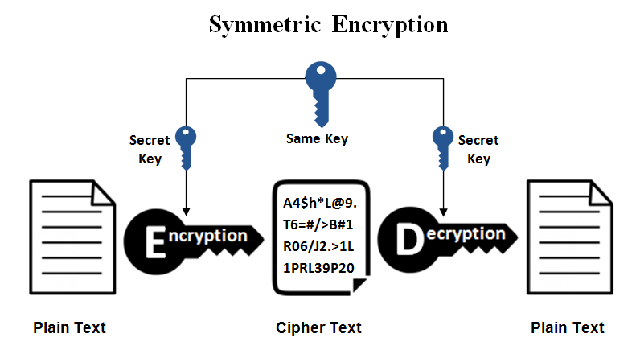
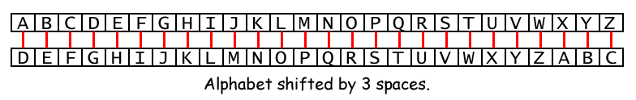
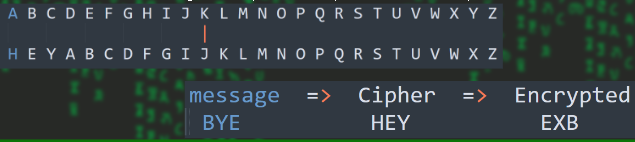
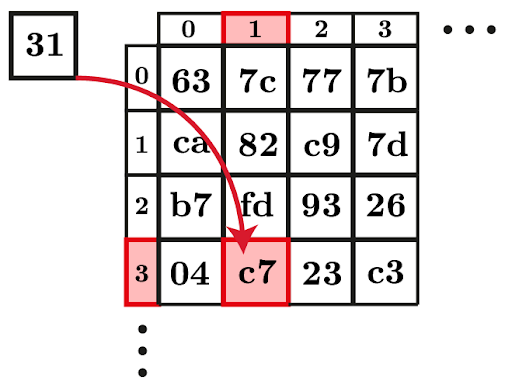
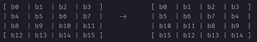

# Cryptography

- Cryptography is the science of secret, or hidden writing
- Crypto => Hidden/Secret  |   Graphy => Writing
- Used to secure your data/text.
- It has two main Components:
    1. Encryption
        - Practice of hiding messages so that they can not be read by anyone other than the intended recipient
    2. Integrity
        - Ensuring that users of data/resources are not been altered

1. **Encryption**

## Cipher

- **Cipher** is a method for encrypting messages.
- Encryption algorithms are standardized & published
- The key which is an input to the algorithm is secret
- **Key**: is a string of numbers or characters.
    - If same key is used for encryption & decryption the algorithm is called **symmetric**.
    - If different keys are used for encryption & decryption the algorithm is called **asymmetric**.

## Symmetric Algorithms

- Algorithms in which the key for encryption and decryption are the same are Symmetric
    - Example: Caesar Cipher,AES,DES

- Types:
    - **Block Ciphers**
        - Encrypt data one **block** at a time (typically 64 bits, or 128 bits)
        - Used for a single message
    - **Stream Ciphers**
        - Encrypt data one **bit** or one byte at a time
        - Used if data is a constant stream of information

### Ceasar Cipher

- **Caesar Cipher** is a method in which each letter in the alphabet is rotated by three letters as shown


### Substitution Cipher 

- Using a key to shift alphabet
- Obtain a key to for the algorithm and then shift the alphabets
    - For instance if the key is word we will shift all the letters by four and remove the letters w, o, r, & d from the encryption
- We have to ensure that the mapping is one-to-one
    - no single letter in plain text can map to two different letters in cipher text
    - no single letter in cipher text can map to two different letters in plain text


- Replacing the letters by 1 shift we can get different rotations.
- To do this we can use this website.
- This encoding is called **rot encoding**

## Data Encryption Standard / DES

- **The Data Encryption Standard (DES)** is a symmetric key encryption algorithm that was once the predominant method for encrypting data.
- Developed by IBM in the early 1970s and adopted as a federal standard by the U.S. National Institute of Standards and Technology (NIST) in 1977, DES played a significant role in the evolution of modern cryptography.
- DES is a block cipher that processes data in fixed-size blocks of 64 bits.
- DES uses a 56-bit key for encryption.
    - Although the key is technically 64 bits, 8 of those bits are used for parity (error checking) and do not contribute to the security of the key.
- DES is no longer considered secure for protecting sensitive information and has been officially withdrawn as a standard by NIST.
    - Modern systems have transitioned to more secure algorithms like AES

### How DES Works

- DES operates by taking a 64-bit block of plaintext and encrypting it using the following steps:
    - **Initial Permutation**: The 64-bit plaintext block undergoes an initial permutation, rearranging the bits in a specific order.
    - **Feistel Rounds**: The block is split into two halves, and 16 rounds of encryption are applied using subkeys derived from the main 56-bit key.
    - **Final Permutation**: After the 16 rounds, a final permutation is applied to the block, yielding the ciphertext.
- The decryption process follows the same steps in reverse, using the same key.

#### Initial and Final Permutation

- The initial and final permutations are straight Permutation boxes (P-boxes) that are inverses of each other.
- They have no cryptography significance in DES.
- The initial and final permutations are shown as follows
- For example in the p-box, if the input is 1,2,3,4,5,
    - the output might be 3,4,2,1,5.
    - This means the values of 1,2,3,4,5 are being arranged in the order of 3,4,2,1,5.

### Fiesel Round

- The Feistel structure splits the 64-bit block of plaintext into two equal halves: a left half (L) and a right half (R).
- The encryption process then consists of 16 rounds, where the two halves of the block are processed and swapped iteratively.
- Each round involves several key operations:
    - Expansion
    - Substitution
    - Permutation
    - XOR with a subkey
    - Swapping halves

### Advanced Encryption Standard/AES

- **The Advanced Encryption Standard (AES)** is a symmetric encryption algorithm that is widely used across the globe to secure sensitive data.
- Developed by Belgian cryptographers *Vincent Rijmen* and *Joan Daemen*.
- AES was adopted as the encryption standard by the U.S. National Institute of Standards and Technology (NIST) in 2001, replacing the older Data Encryption Standard (DES).

    AES operates on Block Cipher which means data in fixed-size blocks , specifically 128-bit blocks. 
        AES performs operations on bytes of data rather than in bits. 
        Since the block size is 128 bits, the cipher processes 128 bits (or 16 bytes) of the input data at a time.
    AES supports three different key lengths, providing varying levels of security:
        AES-128: Uses a 128-bit key.
        AES-192: Uses a 192-bit key.
        AES-256: Uses a 256-bit key.
    Longer keys provide stronger encryption but require more processing power. AES-256 is considered highly secure and is commonly used for top-level security applications.

#### How AES Works

- AES operates using a series of transformations that include substitution, permutation, and mixing of input data. The encryption process consists of several rounds, depending on the key size:
    - AES-128: 10 rounds
    - AES-192: 12 rounds
    - AES-256: 14 rounds
- Each round involves a series of steps:
    - **SubBytes**: A substitution step where bytes are replaced according to a predefined lookup table (S-box).
    - **ShiftRows**: A permutation step where rows of the state are shifted cyclically.
    - **MixColumns**: A matrix multiplication. Each column is multiplied with a specific matrix and thus the position of each byte in the column is changed as a result
    - **AddRoundKey**: A step that adds the round key to the state using bitwise XOR.
- The final round omits the MixColumns step, completing the encryption process. The decryption process follows the reverse of these steps to convert the ciphertext back into plaintext.

1. Substitution Box / S-box

- The S-Box is an important part of symmetric key encryption algorithms. It’s a substitution table used to do nonlinear substitutions in the course of encryption. Each byte of the input is substituted for another byte according to a fixed table which strengthens the confusion and diffusion properties of the encryption.


2. Shift Rows

- This step is just as it sounds. Each row is shifted a particular number of times.
    - The first row is not shifted
    - The second row is shifted once to the left.
    - The third row is shifted twice to the left.
    - The fourth row is shifted Three Times to the left.


#### Applications of AES

- **Data Encryption**: AES is commonly used to encrypt files, folders, and even entire disks in storage devices.
- **Secure Communications**: AES is employed in securing network traffic (e.g., HTTPS, VPNs), wireless communications (e.g., WPA2/WPA3 for Wi-Fi security), and voice-over-IP (VoIP).
- **Cryptographic Protocols**: Many cryptographic protocols, such as TLS (Transport Layer Security) and IPSec, rely on AES for their encryption needs.
- **Government and Military Use**: AES is approved by the U.S. government for encrypting classified information, and AES-256 is used for Top Secret data.

##### Limitation of Symmetric Encryption

- Any exposure to the secret key compromises confidentiality of ciphertext.
- A key needs to be delivered to the recipient of the coded message for it to be deciphered
    - Some intruders can get the key and BOOM! No secret anymore.

## Asymmetric Encryption

- Uses a pair of keys for encryption
    - Public key for encryption
    - Private key for decryption
- Messages encoded using public key can only be decoded by the private key
    - Secret transmission of key for decryption is not required
        - Public key can be exposed so, if i need to send you a message i just ask you for your public key and i will encrypt the message with your public key. When you get the ciphertext you can decrypt it with your private key.
    - Every entity can generate a key pair(private&public) and release its public key

### Types of Asymmetric

- Two most popular algorithms are RSA & El Gamal
1. RSA
    - Developed by Ron Rivest, Adi Shamir, Len Adelman
    - Both public and private key are inter-changable.
    - Variable Key Size (512, 1024, or 2048 bits)
    - Most popular public key algorithm
    - It have a math formulas for generating the keys.
2. El Gamal
    - Developed by Taher ElGamal
    - Variable key size (512 or 1024 bits)
    - Less common than RS

#### Applications

- One of example program that use asymmetric encryption is SSH.
- When you Create/Config SSH on your computer it give u 2 keys, 1 public and 1 private, so when connection is established each hosts exchange their public key and store it in (known_hosts), then anytime they send data they will encrypt them with the public, and the host will decrypt it with its private key.
- So if your Private Key got leaked💀

```bash
ls .ssh
# id_rsa   id_rsa.pub    Known_hosts
```

### 3 Terms of Cryptography

1. Encoding/decoding

    - This is a method of creating Cipher text with out using any key
    - This can be done by doing math on the given input/substitution
        - Examples: base64,base32,rot…
2. Encrypting/Decrypting

    - This is method of creating Cipher text with keys.
    - To decrypts this kind u need to have the private key
        - Example: DES,AES,RSA 
3. Hash Function

    - This is a method of creating Cipher text with respect to a created hash
    - Hash is A random words and numbers combination
    - To reverse the hash, you just search for some match, you don't decrypt/decode it.
    - **Salt**: is a random string used for data modification for password protection, This can be adding some text as prefix/suffix
        - Example: MD5,sha254,

#### Kinds of encodings/encryptions

    Base2   01100010 01110010 01100101 01100001 01101011 01101001 01110100
    Base8   142 162 145 141 153 151 164
    Base16  62 72 65 61 6b 69 74
    Base32  MJZGKYLLNF2A====
    Base58  4jP4KDubX1
    Base62  22udqyscMu
    Base64  YnJlYWtpdA==
    Base85  @WH$gCM@k
    Base91  %zmfv;:YH
    URL encode: hello%20there%20%3F
    Md5: 5d41402abc4b2a76b9719d911017c592
    Sha1: aaf4c61ddcc5e8a2dabede0f3b482cd9aea9434d
    Rot : Uryyb, Frphevgl Grfgref    =>   look for some random word that looks rotated

##### Tools

- There are lots of encodings/encryption
- To identify this we will need some tools/sites
- Tools: 
    - hashid 
        - hashid "hash"
    - Cyber chef (web)
        - https://gchq.github.io/CyberChef/
    - Tunnelsup (web) ==> THis will help You analyze and determine what that hash is based on the bit length and the base.
        - http://tunnelsup.com/hash-analyzer/

## Decoding/decrypting

- There are so, many way to reverse some hashes/ciphers.
    1. Hashes
        - Craskstation.net(non-salted)
        - Own cracking(google the name)
    2. Encodings
        - CyberChef

### Identifying Unknown Hashes

- Sometimes when you do penetration tests you will get some Hash. these hashes are not normal hashes they are generated by some Platform/Software. So to Crack this hash.
    - Identify the Software which the hash Generated with.
        - Ex: The Hash can be generated by some Software called Openfire
    - Then Try to Search Some Cracking Scripts made for this hash

#### Wordlists

- **Wordlists** are a normal text file that contains Different Words that can be used to match hashes, or for checking some parameters repeatedly using some loops.

##### Custom Wordlists

- We can Create our own Wordlists, We can Create text file and add our highly usable words or we can use tools like
    - Cewl
    - Cupp
    - crunch

### Python for cryptography

- We can use programming to do tools that can do our own encryption and encoding hash type
- There are so many methods, even you can do the encoding/decodeing for the base64…
- You just need to understand the maths.
- Now i will show u simple XOR’ing example

#### Obfuscation

- In software development, obfuscation is the act of creating source or machine code that is difficult for humans or computers to understand.
- As we know High level programming lang. are easy to understand, so if hackers got your code he can read it, but to make it more difficult we use this technique
- website ==> https://pyobfuscate.com/pyd