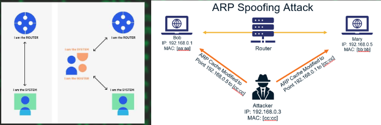
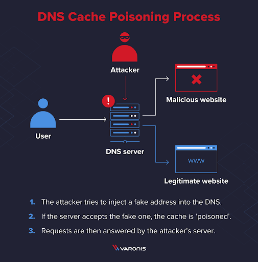
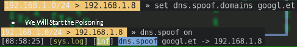

# Network Hacking

- **Network Hacking** is gathering and exploiting of networks.
- *Network Hacking* is an offensive branch of computer security related to networks hacking and the penetration of a target via the networking services or equipment. 
- This includes
    - Network information gathering
    - Sniffing
    - Network Attacks

## Network footprinting

- There Are Different tools, that can help Us On Our Network Recon Process.
    - Nmap
    - Ping
    - TraceRoute
    - Arp
    - Netstat
    - ss

1. **Ping**

- Ping is one of the most fundamental and widely used network utilities.
- It's primarily used to test the connectivity between two network devices by sending ICMP.
- We can Perform Different Changes With Ping Command
    - Count ( -c )
    - Packet Size ( -s )
- Variants of Ping:
    1. **fping**: to ping multiple hosts simultaneously.
    2. **nping**: allowing more advanced packet crafting and timing tests.
    3. **hping**: A more advanced tool that allows sending custom TCP, UDP, and ICMP packets.

2. **Traceroute**

- Traceroute is a network diagnostic tool used to trace the path that packets take from a source to a destination across a network.
- It helps determine the route taken by packets and measures the time taken for each hop along the way.

3. **Netstat**

- **netstat (short for Network Statistics)** is a command-line utility used to display network connections You made, routing tables, interface statistics, and multicast memberships.
- Functions of netstat
    - Display Active Connections
    - Show Listening Ports
    - View Network Interface
    - Statistics
    - Display Routing Tables

4. **SS**

- **ss (Socket Statictics)** is a utility used to investigate sockets, and it provides detailed information about network connections, listening ports, and more.
- It is often preferred over netstat for its faster performance and more detailed output.
    - -t : tcp
    - -u: udp
    - -l: listening
    - -p: process

### Network sniffing

- **Sniffing** is the process of monitoring and capturing all the packets passing through a given network using sniffing tools. It is a form of “tapping phone wires” and get to know about the conversation.

#### Types of Sniffing

1. Passive Sniffing
    1. In passive sniffing, the traffic is Visible but it is **not altered** in any way. Passive sniffing allows listening only.
    2. It works with Hub devices. On a hub device, the traffic is sent to all the ports. In a network that uses hubs to connect systems, all hosts on the network can see the traffic. Therefore, an attacker can easily capture traffic going through.
    3. The good news is that hubs are almost obsolete nowadays. Most modern networks use switches. Hence, passive sniffing is no more effective.
2. Active Sniffing
    1. In active sniffing, the traffic is not only monitored, but it may also be **altered** in some way as determined by the attack.
    2. Active sniffing is used to sniff a switch-based network.

#### Sniffing networks

- To Sniff on Networks, There are many Tools We can use.
    - Wireshark
    - Tcpdump
    - Tshark
    - Microsoft Message Analyzer
    - Network Miner

## Wireshark

- It is One popular passive monitoring tool.
- Wireshark technically is referred to as a “protocol analyzer”, but it uses only passive observation of network traffic.
- Wireshark supports both live and offline analysis,
- Has a graphical user interface,
- Can be used for analyzing multiple protocols.
- It is for windows and linux.
- It can Capture and record network Traffics and Save it in Form of **cap/pcap** file.

### Understanding Networking With WireShark

- The WireShark Will Describe Data with the OSI layer format on the Packet Detail Pane And Also On Protocol Hierarchy , However, Wireshark primarily focuses on the lower layers (from Physical to Transport) and does not explicitly break down the Session and Presentation layers as distinct entities in its display.
- Wireshark Can Display The Network Connections Established and The Ports You connected through TCP/UDP.

#### Filter Commands

- ip.src == "ip address" && ip.dst == "ip address"
- ip.src eq "ip address" and ip.dst eq "ip address"
- ip.src == "ip address" || ip.dst == "ip address"
- http && (ip.src == "ip address" || ip.src == "ip address")
- !(ip.dst == "ip address")
- ssh

##### Exporting Data

- You can Export Your Traffic Based on their Type. 
- Example: if we have some http sites accessed on the network we can export that network traffic that means we will have the html code.

### Tshark

- **Tshark** is a command line tool like the wireshark it can capture.

### TCPdump

- **tcpdump** is a powerful command-line packet analyzer tool that captures and displays network packets transmitted and received over a network interface.
- Syntax: sudo tcpdump -i "interface"
- You can Save the Capture
    - sudo tcpdump -i eth0 -w capture.pcap
- You can Capture Specific Protocol/Port
    - sudo tcpdump -i eth0 port 443
    - sudo tcpdump -i eth0 icmp

## What is ARP /Address Resolution Protocol/

- **Address Resolution Protocol (ARP)** is a procedure for mapping a dynamic IP address to a permanent physical machine address in a local area network (LAN). The physical machine address is also known as a media access control (MAC) address.
- The reason why we need ARP is because computers need to know both the IP address and the MAC address of a destination before they can start network communication.

### ARP Command

- A Command Line tool that will Display the Mac Table Cached on our Computer.
- When Your Computer Sends ARP Requests:
    - **Initial Communication**: When your computer needs to send data to another device on the same network, it checks its ARP cache to see if it already knows the MAC address associated with the destination IP address.
    - **ARP Request**: If the MAC address is not in the ARP cache, the computer broadcasts an ARP request packet on the network. This request asks, "Who has IP address X? Tell me your MAC address."
    - **ARP Reply**: The device with the matching IP address responds with its MAC address.
    - **Caching**: After receiving the ARP reply, the computer stores the IP-to-MAC address mapping in its ARP cache for future use.

## Mac flooding

- MAC Flooding is one of the most common network attacks. 
- Unlike other web attacks,  MAC Flooding is not a method of attacking any host machine in the network, but it is the method of attacking the network switches. 
- However, the victim of the attack is a host computer in the network.
- the switches maintain a table structure called MAC Table. 
- This MAC Table consists of individual MAC addresses of the host computers on the network which are connected to ports of the switch.
- This table allows the switches to direct the data out of the ports where the recipient is located.
    - As we’ve already seen, the hubs broadcast the data to the entire network allowing the data to reach all hosts on the network but switches send the data to the specific machine(s) which the data is intended to be sent.
    - This goal is achieved by the use of MAC tables.
- The aim of the MAC Flooding is to takedown this MAC Table. 
- In a typical MAC Flooding attack, the attacker sends Ethernet Frames in a huge number. When sending many Ethernet Frames to the switch, these frames will have various sender addresses. The intention of the attacker is consuming the memory of the switch that is used to store the MAC address table. 
- The MAC addresses of legitimate users will be pushed out of the MAC Table.
- Now the switch cannot deliver the incoming data to the destination system. So considerable number of incoming frames will be flooded at all ports.
- I have set ping sweep on my windows to check the connection
- Wireshark to see the package
- And used **macof** tool for the mac flood.
- Also can be sent to specific 1 destination /ip
- The command needs
    - sudo
- **Macof** will send a lot of fake MAC’s to the switch and makes if confused, and do stop proper functioning this can cause , disconnections between hosts.

### Prevention

- Port Security – Limits the no of MAC addresses connecting to a single port on the Switch.
- MAC Filtering – Limits the no of MAC addresses to a certain extent.

## ARP Spoof

- **ARP** translates *Internet Protocol (IP) addresses to a Media Access Control (MAC)* address
- Most commonly, devices use ARP to contact the router or gateway that enables them to connect to the Internet.
- An ARP spoofing, also known as ARP poisoning, is a Man in the Middle (MitM) attack that allows attackers to intercept communication between network devices. The attack works as follows:
    1. The attacker must have access to the network. They scan the network to determine the IP addresses of at least two devices⁠—let’s say these are a workstation and a router. 
    2. The attacker uses a spoofing tool, to send out fake ARP responses. 
    3. The fake responses advertise that the correct MAC address for both IP addresses, belonging to the router and workstation, is the attacker’s MAC address. This fools both router and workstation to connect to the attacker’s machine, instead of to each other.
    4. The two devices update their ARP cache entries and from that point onwards, communicate with the attacker instead of directly with each other.
    5. The attacker is now secretly in the middle of all communications

1. We will get the mac of our gateway
2. We will get our linux machine mac
    - arp -g
3. Enable ip forward
    - sudo sysctl net.ipv4.ip_forward=1
4. Disable Firewall
    - sudo ufw disable
5. Start the spoofing with arpspoof tool
    - Arpspoof -i interface -t target -r defaultgatewayip

### In bettercap

1. Install bettercap
2. Start bettecap
3. Scan the network
    - net.probe on
    - net.show  => to see the network
4. Start arp spoofing
    - set arp.spoof.targets "ip"
    - set arp.spoof.fullduplex true
    - arp.spoof on
5. Enable Forwarding and Disable Firewall
    - sudo sysctl net.ipv4.ip_forward=1
    - sudo ufw disable
6. Start Mitm
    - net.sniff on
    - net.sniff off

#### Prevention

- Using static ARP tables: manually setted
- Switch security: some feature for ARP poisoning
- Encryption: not for arp but in case of leaks

## DNS Spoofing

- **DNS(domain name system)** is the phonebook of the Internet, connecting web browsers with websites.
- Domain Name Server (DNS) spoofing, or DNS cache poisoning, is an attack involving manipulating DNS records to redirect users toward a fraudulent, malicious website that may resemble the user’s intended destination.

### How Does DNS Spoofing Work?

- DNS spoofing works by exploiting flaws in the DNS and its associated protocols. An attack can be accomplished in several ways:
    1. A malicious actor may use address resolution protocol (ARP) to access router traffic and alter the domain name resolution records.
    2. The attacker can modify an authoritative DNS server’s records, redirecting traffic to the fraudulent website.
    3. The attacker can target an intermediate name server and exploit weaknesses in its caching system to perform a Man-in-the-Middle (MITM) attack.

- We will Prepare our Site to Spoof on our Local Host.
- This can be Our Phishing page.
- We Have To Do Arp-Poisoning 1st.
- We will Perform the DNS Spoof with Bettercap.
- We will Set Domain to Spoof
- We Will Start the Poisoning

#### DNS Obtaining

- Hosts, Sometimes get DNS Server Address Directly From the Router when they Get Assigned IP with DHCP or They Might Get Static DNS.
- In this, It is Hard to assign A Already Used Domain for our Poisoning.
- But Most Of the Time If the Sites does not Have **HSTS** We can Try to Poison with their domain.

#### HTTP Strict Transport Security / HSTS

- **HTTP Strict Transport Security (HSTS)** is a web security policy mechanism that helps protect websites against attacks such as protocol downgrade attacks and cookie hijacking.
- **HSTS** forces browsers to interact with websites only over HTTPS, ensuring that all communication is encrypted.
- This Policy Can Make Us Stop Poisoning the DNS on that Domain.

#### Protocol Downgrade Attack

- It is An Attack that can be Performed by Downgrading The HTTPS to HTTP
- This will enable us to Sniff the traffic, with unencrypted way.

## DOS and DDOS Attacks

- **DoS** is short for Denial-of-Service attacks.
- **DDoS** stands for Distributed Denial-of-Service attack.
- It's used to crash a website by overwhelming the network with access requests from a computer. This method also crashes a targeted website and makes it unavailable to legitimate users.(like Mac spoofing)
It is purposeful attack
- On DDOS, the request will be sent from DIfferent Computers/hosts this will make the attack harder.
- IT is Highly illegal!
- Techniques:
    - SYN floods
        - Sending lots of SYN
    - Service Request floods
        - Create many connections
    - Application level DOS
        - Exploiting vulns like
            - Buffer Overflow
            - SQL injection

### Tools For DOS

1. SolarWinds Security Event Manager (SEM)
2. ManageEngine Log360
3. HULK
4. Tor’s Hammer
5. Slowloris
6. LOIC
7. Xoic
8. DDOSIM
9. RUDY
10. PyLoris

#### Prevention ways

- Have you seen Cloudflare, These pages are One of the prevention ways.
- Limit or shut off broadcast forwarding where possible
- Set up firewalls
- Eliminate and patch known vulnerabilities
- Monitor network inbound traffic

#### General Prevention Techniques

- Preventing network attacks is crucial for maintaining the security and integrity of computer networks.
- Here are some key measures and best practices to help prevent cyber attacks:
    1. Deploy a Robust Firewall
    2. Deploy Intrusion Detection and Prevention Systems (IDS/IPS)
    3. Implement Strong Data Encryption
    4. Implement Strong Access Controls
    5. Conduct Regular Vulnerability Assessments and Penetration Testing
    6. Implement Comprehensive Network Monitoring
    7. Regular Updates and Patching
