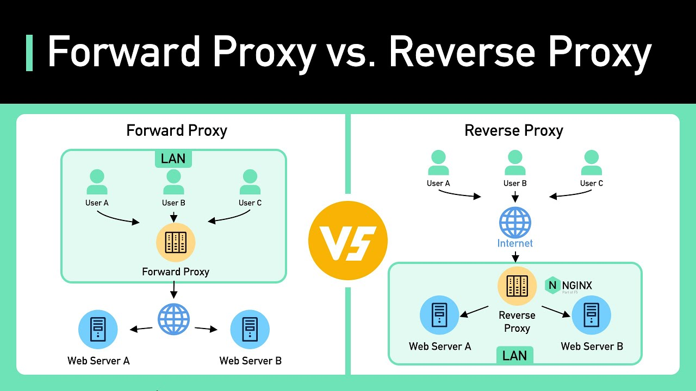
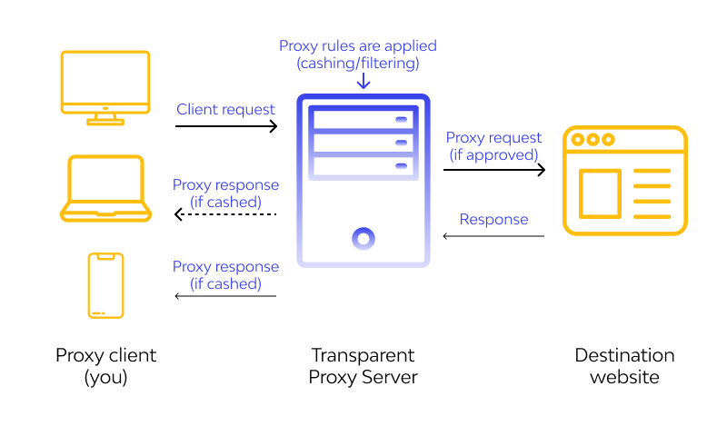
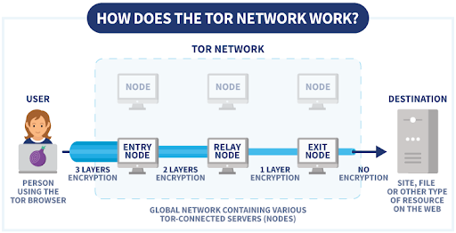
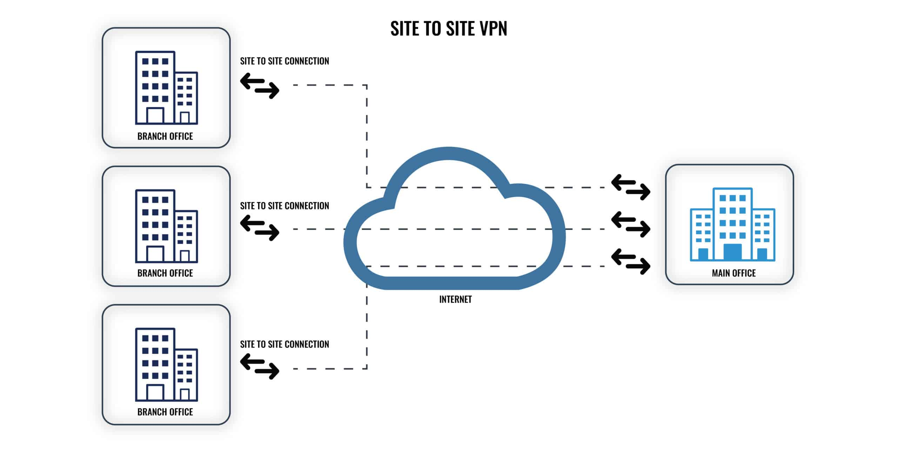

# Anonymity

- **Anony** means unknown.
- When Black Hat Hackers do Security tests / Cyber Crimes on some target, They will be unknown, because they are doing illegal things so they try to be anonymous.
- Anonymity is Simply using a fake *Profile/Location/Identity/personality*.

## Online privacy

- These Programs are simply not logging what we are doing(aka history,cache,cookie) but still the site we visit with this program will have our ip and other information also our **ISP/internet service provider/** will know.
- Therefore, they don't give as real privacy.

### Methods of Anonymity

- There are several ways to be protected or to be Anonymous on the internet.
- These methods can change our identity,location or personality.
    a. Proxychains
    b. Tor Network
    c. VPN
    d. Mac change
    e. Incognito
    f. Secured OS
    g. Temp mail

#### Proxy server

- A **proxy server** is an intermediary server that separates end users from the Server they Access.
- It provides varying levels of functionality, security, and privacy depending on the use case.
- Proxy means intermediary(middle).

##### Purpose of proxy

a. Anonymity
b. Traffic filtering
c. Load balancing
d. Caching

##### Types of proxy

- While all proxy servers give users an alternate address with which to use the internet, there are several different kinds—each with its own features.
    1. Forward Proxy
    2. Reverse Proxy
    3. Transparent Proxy

1. Forward Proxy

- Sits in front of clients and forwards client requests to the internet.
- It provides IP address security for those in the network and allows for straightforward administrative control.
- Use Cases:
    - Bypassing geo-blocks
    - Hiding IP addresses

2. Reverse Proxy

- Sits in front of web servers and forwards client requests to servers.
- Use Cases:
    - Load balancing
    - Web acceleration
    - Application firewall / WAF 

3. Transparent Proxy

- A proxy that does not modify requests or responses; users may not be aware of it.
- Use Cases:
    - Caching
        - can cache frequently accessed content to improve network performance by reducing bandwidth usage and speeding up access to commonly visited sites
    - Content filtering / IDS-IPS
        - For blocking access to specific websites or content.

### Anonymous Proxy

- Masks the client's IP address but identifies itself as a proxy.
- An **anonymous proxy** focuses on making internet activity untraceable.
- It works by accessing the internet on behalf of the user while hiding their identity and computer information.
- Use Cases:
    - Basic anonymity without full stealth

## Proxy Protocols

- Proxy servers operate using a variety of protocols depending on their intended purpose and the type of traffic they handle.
    1. HTTP Proxy
        - Handles HTTP traffic. It is used for web browsing, content filtering, and caching.
    2. SOCKS Proxy (SOCKS5)
        - A general-purpose proxy that works at the transport layer. It can handle any traffic type (e.g., HTTP, HTTPS, SMTP, FTP).
        - Forwards raw data between client and server, without interpreting it.
        - **SOCKS5** supports *authentication*, making it more secure than older versions(SOCKS4).

1. **Proxy chains**

- Proxy chain is simply a chain of proxies.
- We have a lot of proxy lists so our request will pass through lot of proxies.
- This will hide our IP.

#### Types of proxy chains

- Based on the Sequence of Proxy Servers we follow, There are 4 Types of proxychains.
    1. Dynamic chain
    2. Strict Chain
    3. Round Robin Chain
    4. Random Chain

1. Dynamic chain

- Dynamic Chaining is That way the proxy Servers are chained is as the proxy list given.
- If there is any server that is not working it will be skipped.
- If any of them doesn’t work it will be broken and display errors.

2. Strict Chain

- All Proxies chained in the order as the are listed.
- All proxies Have to be up and working, if one server is not working it will display error

3. Round Robin Chain

- It follows the order of the proxy list
- It will skip if 1 proxy is not working
- If all the proxies not working it will start again and check them, This makes it different from Dynamic chain.

4. Random Chain

- It will choose some Proxy server Randomly and creates chain in random order.
- Not working will be Skipped!
- Each Request will be in random sequence of servers.
    - to get free proxy servers ===> https://www.geonode.com/
    - to manage your proxy chain and type in linux.
        - go to /etc/proxychains4.conf
            - Turn on any kind proxychain you need
            - Put your proxy servers with format of ==> "Protocol IP PORT UserName Password"
    - Accessing with proxychains
        - Add “proxychains” in front of any command.

2. **T.O.R(The Onion Routing) Network**

- **Tor** is a free overlay network for enabling anonymous communication.
- Built on free and open-source software and more than 7000 volunteer-operated relays worldwide, users can have their Internet traffic routed via a random path through the network.
- Tor was initially conceptualized in the mid-1990s by the United States Naval Research Laboratory (US NRL).
- It was developed for the military to protect sensitive communications and enable anonymous intelligence gathering.
- Initially called "*Onion Routing*," referring to the multiple layers of encryption involved.

### How to works

- **Tor Nodes**: A node in a network is any device or point that can send, receive, or process data.
    - **Entry Node**: The first relay, which knows your IP address but not your final destination.
    - **Middle Relays**: Multiple intermediate relays that obscure your traffic route.
    - **Exit Node**: The last relay that decrypts the final layer and sends your traffic to the destination server.
- Tor can be slower than traditional browsing due to multiple relays.
- **Onion Encryption**
    - Data is encrypted in multiple layers, each decrypted at a different node, hence the “onion” analogy
        - Each relay (node) in the Tor network has a public-private key pair/RSA/.
        - When your data is routed through the Tor network, the client (your device) encrypts the data multiple times, using the public keys of the nodes in the path.

- if you want tools ===> **torghost**

3. **VPN(Virtual private network)**

- is a service that helps you stay private online.
- A VPN establishes a secure, encrypted connection between your computer and the internet, providing a private tunnel for your data and communications while you use public networks.
- There are a lot of VPNS, those are paid and free
    - Example: Nord VPN, Proton VPN, windscribe VPN,...

### Types of VPN

A. site to site

- This is most commonly used to join company networks together over the Internet
- It allows multiple locations to communicate over the Internet as if they were local. like Router + Routers

B. Remote Access VPN

- involves the client's computer creating a virtual interface that behaves as if it is on a client's network.
- Hacking game utilizes **OpenVPN**, which makes a TUN Interface letting us access the labs.
- When analyzing these VPNs, an important piece to consider is the routing table that is created when joining the VPN.

C. SSL VPN

- Essentially a VPN that is done within our web browser and is becoming increasingly common as web browsers are becoming capable of doing anything.
- These will stream applications or entire desktop sessions to your web browser.
- These VPNs are like extensions.

### Types of VPN protocols

- A VPN protocol is the set of rules that govern how data moves between a VPN server and devices connected to it.
- Every VPN uses a form of encryption to achieve a secure, private connection, but the rules and procedures for creating this connection are established by a particular protocol, each with its own pros and cons.

A. Open VPN

- OpenVPN is a cryptographic protocol that emphasizes security.
- It’s open source, so users can check for themselves that there’s nothing within the protocols that will compromise their security, and it’s even possible for tech-savvy users to make modifications
- Sometimes, firewalls can interfere with VPN network access, but OpenVPN is designed to avoid this kind of conflict.

B. IPSec / IKEv2

- **Internet key exchange version 2 (IKEv2)** is often used in combination with Internet Protocol Security (IPSec).
- **IKEv2** forges a secure tunnel connecting the user to the VPN server, while IPSec provides the encryption and authentication.
- IKEv2 is among the fastest VPN protocols around, making it attractive for VPN users who prioritize speed and streaming.
- IKEv2 is among the most dependable protocols, providing a strong connection to the VPN even when the internet momentarily drops, meaning you don’t have to constantly check if your VPN is working.
- Although some open-source versions are available for other platforms, IKEv2 was primarily designed for Windows users.

C. WireGuard

- Like OpenVPN, WireGuard is an open-source VPN protocol.
- It’s a relatively new option with promising performance, but it’s still under development and is something of a work in progress.
- Efficient encryption and high performance make WireGuard one of the fastest VPN protocol options available.
- WireGuard uses lower bandwidth, making it an ideal solution for mobile.

4. **mac changer**

- As We saw MAC address can tell about our Device.
- SO , if we changed that we can change our device id.
- We can use tool called “macchanger” on kali
    - First turn off the interface you want to change. ===> "sudo ifconfig eth0/wlan0 down"
    - then change your mac address ===> "macchanger -s wlan0/eth0"
    - You can add your specific MAC with -m option ===> "macchanger -m mac-address wlan0/eth0"
    - Finally turn on your interface ===> "sudo ifconfig wlan0/eth0 up"

5. **Incognito mode**

- This is a mode that browsers have.
- This will help you to have a browser with out logging your history,cookies,cache,..
- This will help you when you are try to surf some site but if you don't need the site to know your identity, you can use this because it doesn't have any recording process.

6. **Secure OS**

- These are Operating systems, that have a security and privacy feature.
- Windows and Mac OS will record some of your activity also they are not good on privacy and security .  
- There for the always Best OS Linux is always recommended when you think about privacy and Security.
    - Tails OS
    - Whonix OS
    - Qube OS

7. **Temporary Mail**

- While You do some pentest you don't have to expose your email and profile for this purpose u need fake emails, but if you don't have to time create one you can use fake email providers.
- The website is ===> https://temp-mail.org/
- It have a browser extention too.

## Deep web

- The deep web refers to all the web pages and data that are not indexed by search engines and cannot be accessed through traditional search methods. It includes content that is protected by passwords, databases, and other security measures.
- Examples of deep web content include private email accounts, online banking portals, subscription-based websites, and more.
- Essentially, the deep web is the part of the internet that is not easily accessible to the general public.

## Dark web

- The dark web is a part of the internet that isn't indexed by search engines. 
- The dark web is a small portion of the deep web that is intentionally hidden and requires specific software or configurations to access.
- It is unique type of internet world.
- Their link ends with **.onion** , this is because it uses **TOR** networks.
- Also this kinds of links won’t be opened by normal browser.
- For this purpose we need a special .onion Client browser,
    - Example: Tor browser.
- Many kinds of websites are there.
    - You can buy *credit card numbers*, all manner of *drugs*, *guns*, *counterfeit money*, *stolen subscription credentials*, *hacked Netflix accounts* and *software* that helps you break into other people’s computers.
    - Buy login credentials to a $50,000 Bank of America account, counterfeit $20 bills, prepaid debit cards, or a “lifetime” Netflix premium account.
    - You can hire hackers to attack computers for you. You can buy usernames and passwords.
- Also there are emailing service sites and normal facebook too(but more secured).
- As you see This side of internet is little bit dangerous because a lot of evil hackers are there.
- For this purpose we have to change our identity, so we use Anonymity.
    - Using Secured OS is recommended, for better Security and Privacy.
    - We can use these OS for more Anonymity, but still the dark web sites are not easy to find.
    - Also TOR browser is so slow, based on your internet speed, it might not show you the correct result.
