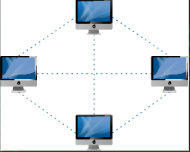
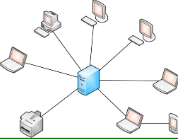
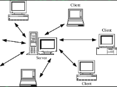
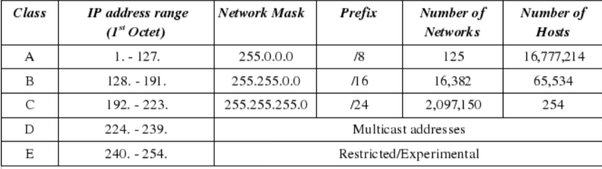
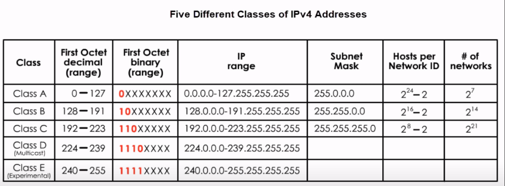
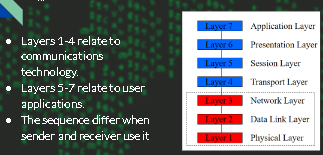
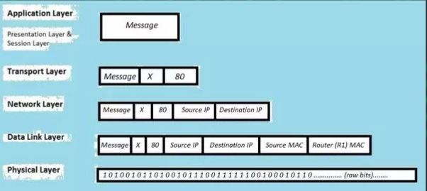
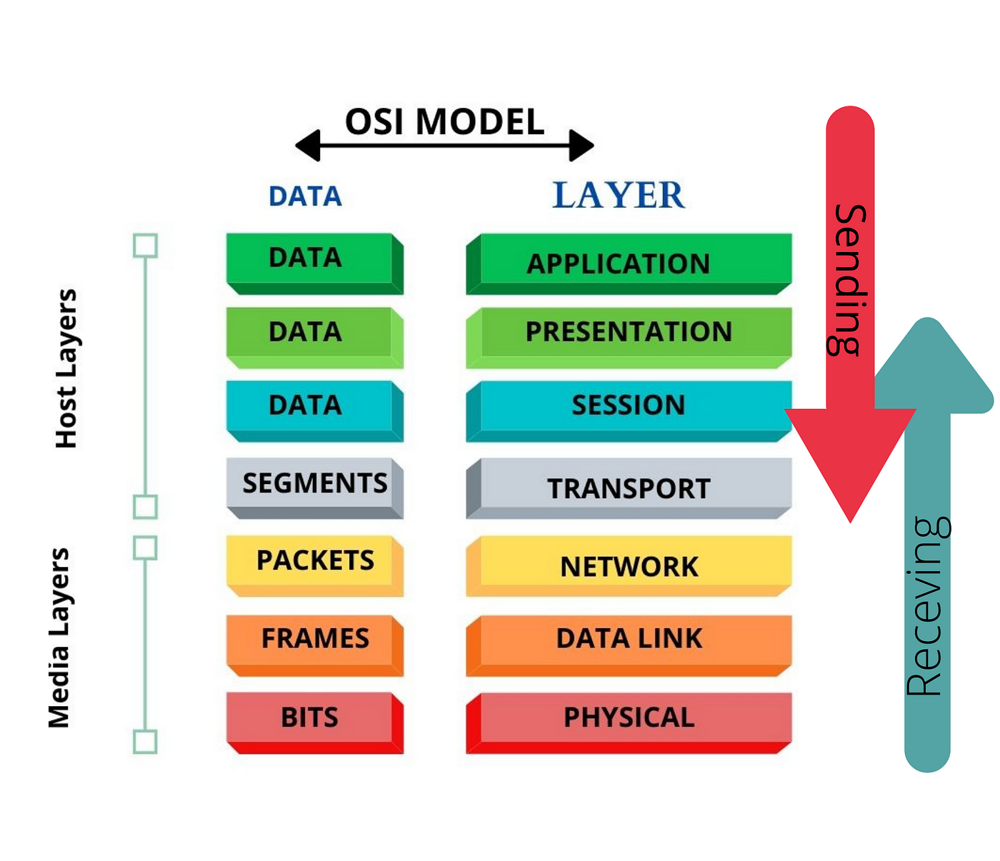
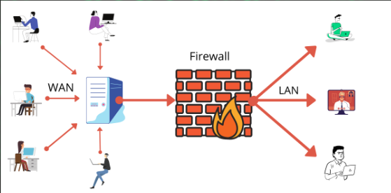

# Introduction to Networking

- A network consists of two or more entities or objects sharing resources and information.
- A computer network consists of two or more computing devices connected to each other to share resources and information.
- The network becomes a powerful tool when computers communicate and share resources with other computers on the same network or entirely distinct networks.
- Computers on a network can act as a **client** or a **server**.

1. **Client computer** - is a computer that requests for resources.
2. **Server computer** - is a computer that controls and provides access to resource, But have higher RAM,CPU and storage.

## Need of Networks

- Enhance communication.
- Share resources.
- Facilitate centralized management
- Internet

### classification of Networks

1. Classification by network geography
2. Classification by component roles

-----------

1. **Classification by Network Geography**

- Networks are frequently classified according to the geographical boundaries spanned by the network itself.
- **LAN**, **WAN**, and **MAN** are the basic types of classification, of which LAN and WAN are frequently used.

#### Local Area Network(LAN)

- A **LAN** covers a relatively small area such as a classroom, school, or a single building.
- **LANs** are inexpensive to install and also provide higher speeds.

#### Metropolitan Area Network(MAN)

- A **MAN** spans the distance of a typical metropolitan city.
- The cost of installation and operation is higher.
- **MANs** use high-speed connections such as fiber optics to achieve higher speeds

#### Wide Area Network(WAN)

- WANs span a larger area than a single city.
- These use long distance telecommunication networks for connection, thereby increasing the cost.
- The Internet is a good example of a WAN.

2. **Classification by Component Roles**

- Networks can also be classified according to the roles that the networked computers play in the network’s operation.
- **Peer-to-peer**, **server-based**, and **client-based** are the types of roles into which networks are classified.

#### Peer-to-Peer

- In a peer-to-peer network, all computers are considered equal.
- Each computer controls its own information and is capable of functioning as either a client or a server depending upon the requirement.
- **Peer-to-peer** networks are cheap and easy to install.
- They are popular as home networks and for use in small companies.
- Most operating systems come with built-in peer-to-peer networking capability.
- The maximum number of peers that can operate on a peer-to-peer network is ten.
- Each peer shares resources and allows others open access to them.

#### Server based

- A server-based network offers centralized control and is designed for secure operations.
- In a server-based network, a dedicated server controls the network.
- A dedicated server is one that services the network by storing data, applications, resources, and also provides access to resources required by the client.

#### Client-based

- Client-based network servers process requests from clients and return just the results.
- These networks take the advantage of the powerful processing capabilities of both the client and the server.

# IP(Internet Protocol) address

- **IP (Internet Protocol)** is a Network Layer Protocol.
- A way to identify machines on a network
- A unique identifier

## Usage of IP's

- used to connect to another computer or network.
- Allows transfers of files and email.
- used to identify a device.

### IP types

- Based on IP versions
    1. IPv4
    2. IPv6

-----------

1. IPv4 (Internet protocol version 4)

- An IPv4 address is a 32-bit sequence of 1s and 0s.
- To make the IP address easier to use, the address is usually written as four decimal numbers separated by periods.
- This way of writing the address is called the dotted decimal format.
IP generated by DHCP or Manually

### IP structure

- IP address consist of four sections and each sections has 8 bits long.
- Each section can range from 0 to 255.
- When you connect to some network an IP address will be generated and given(automatically by DHCP or static way).
- Every IP address has two parts:
    1. **Network:** to identify the network
    2. **Host:** identify the user
- The first(1) host address is called **GATEWAY ADDRESS**.

### Private and Public IP addresses

- Any HOST have 2 different IP’s
    1. **Public IP:**is an ip address that is given to the host on the WAN network.
    2. **Private IP:**is ip that is given to the host on LAN network.
- There are 5 classes of private IP address A, B, C, D and E.
    1. **CLASS A:**Governments
    2. **CLASS B:**medium Companies
    3. **CLASS C:**small companies
    4. **CLASS D:**MultiCasting(streaming)
    5. **CLASS E:**Future Use (IETF research)

#### Reserved IP Addresses

- Certain host addresses are reserved and cannot be assigned to devices on a network.
    1. Addresses beginning 127 are reserved for loopback and internal testing.
    2. An IP address that has binary 0s in all host bit positions is reserved for the network address.
    3. An IP address that has binary 1 or 255s in all host bit positions is reserved for the broadcast address.
- Examples of Reserved addresses:- 0.0.0.0, 127.0.0.0, 128.0.0.0, 191.255.0.0, 192.0.0.0, 223.255.255.0, etc...

2. IPv6 (Internet Protocol Version 6)

- IPv6 is a 128-bit alphanumeric long value that identifies an endpoint devices in IPv6 network.
- Format of an IPv6 address ===> FE80:CD00:0000:0CDE:1257:0000:211E:729C
    - ALPHANumeric
    - Separated by colon(:)
    - IP generated automatically.
- The main difference is the IP-space(host holding) IPv4 holds 32-bit ip address but IPv6 holds 128-bit ip Addresses.

## MAC (Media Access Control) Address

- It is Given by A manufacturer of that network adapter.
- Network adapter is a hardware device that helps us to have connection ( our wifi adapter or our ethernet port)
- It is Alphanumeric, with 2 part
    1. **Organizational Unique Id** ===> *The first 3 parts of MAC.*
        - Determines the 1st 24 bits of the address
        - Assigned by IEEE Registration Authority.
        - Eg: Dell, Toshiba, Hp, etc...
    2. **Universally Administered Address** ===> *The second 3 parts of MAC.*
        - Allocated by the manufacturer

# OSI (Open Systems Interconnection) Reference model

- Back in Days, Different Company Devices can’t Communicate or create network
- OSI Reference Model - internationally standardized network architecture.
- Specified in ISO 7498.
- It is an idea model to show the way of network work
- Model has 7 layers.
- It shows How Data transfers between 2 hosts/servers.

## Application Layer

- Level at which applications access network services.
    - Represents services that directly support software applications for *file transfers, database access, and electronic mail, BROWSERS* etc.
- Your data is **DATA**
- PROTOCOLS: **HTTP,FTP,SMTP**

## Presentation Layer

- Related to representation of transmitted data
- Translates different data representations from the Application layer into uniform standard format
- Providing services for secure efficient data transmission
    - Eg: *data encryption*, and *data compression*.
- Your data is **DATA**
- PROTOCOLS: **SSL**

## Session Layer

- Allows two applications on different computers to *establish, use, and end a session.*
    - e.g. file transfer, remote login
- Establishes dialog control
- Regulates which side transmits, plus when and how long it transmits.
- Performs token management and synchronization.
- Your data is **DATA**
- PROTOCOLS: **RPC**,**NETBIOS**

## Transport Layer

- Manages transmission packets
    1. Repackages long messages when necessary into small packets for transmission [ sender ]
    2. Reassembles packets in correct order to get the original message. [ receiver ]
- Handles error recognition and recovery.
    - Transport layer at receiving acknowledges packet delivery.
    - Resends missing packets
- Your data is **SEGMENTS**
- PROTOCOLS: **TCP,UDP**

## Network Layer

- Manages addressing/routing of data within the ip range
    1. Addresses messages and translates logical addresses and names into physical addresses.
    2. **Determines the route from the source to the destination computer**
    3. Manages traffic problems, such as *switching*, *routing*, and *controlling* the congestion of data packets.
- Your data is **PACKETS**
- PROTOCOLS: **ICMP,ARP,NAT,IP**

## Data Link Layer

- Packages raw bits from the Physical layer into frames (logical, structured packets for data).  [ receiver ]
- Provides **reliable transmission of frames**
    1. It waits for an acknowledgment from the receiving computer.
    2. Retransmits frames for which acknowledgement not received
- Your data is **FRAMES**
- PROTOCOLS: **PPP,NDP,CDP**

## Physical Layer

- Transmits bits from one computer to another
- Regulates the transmission of a stream of bits over a physical medium.
- Defines how the cable is attached to the network adapter and what transmission technique is used to send data over the cable. Deals with issues like
    - The definition of 0 and 1, e.g. how many volts represents a 1, and how long a bit lasts?
    - How many pins a connector has, and what the function of each pin is?
- Your data is **Bits**
- PROTOCOLS/DEVICES: **RS-449**

----------

----------

# TCP and UDP 

## TCP (Transmission control Protocol)

- It is Reliable and Connection-Oriented protocol.
- It means it stablishes  a connection between the receiver and sender.
- It use 3 way HandShake.
- Used on emails, Chat, Watching online videos, simple browsing. 

## UDP (User Datagram Protocol)

- It is connection-less and less reliable, but faster and more straight-forward.
- It's often used in situations where higher speeds are crucial, like in streaming or Gaming.

### TCP/IP

- It is A reference model like the OSI model
- TCP/IP is the new and most used Model at this time.
- This model have 4 layers(used to be 5 layer).
- Application,Presentation and session layers are combined together and called **APPLICATION**.
- Data link layer and physical layer combined and called network access layer.

#### Firewall

- **firewall**: is a network security device that monitors incoming and outgoing network traffic and decides whether to *allow* or *block* specific traffic based on a defined set of security rules.
- It is Just A collection of rules to allow and deny network traffics

##### Networking Tools

1. Hub
2. Switch
3. Router
4. Repeater
5. Modern-Router
6. Gateway
7. Bridge, etc....