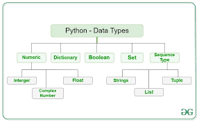

# Programming language

- is language which helps to communicate with computer(they are not able to understand human language).
- Computers have many languages too. Example:- Assembly, C, C++, Java, Javascript, Python, Ruby, etc...
- It is used to write programs using those languages.

# What is program

- **Program** is an algorithm expressed in a programming language.
- **Algorithm** is a detailed sequence of action to perform to accomplish some task. Named after an Iranian mathematician, Al-Khwarizmi.
- Technically, an algorithm must reach a result after a finite number of steps.
- With those steps Programs Do a Specific task Correctly.

## Evolution of I/O { Input / Output }

- Early in the history of computing, programs were submitted on punch cards with all the data they required and executed together with other programs that used the same libraries. Output was to a line printer.
- Later developments introduced interactive processing which allowed the user to provide data while the program was running. This normally takes place in a Question & Answer format.

## Generation of Computers

1. First Generation: Vacuum Tubes  =>  punch cards 
2. Second Generation: Transistors   => Programming started here with Assembly
3. Third Generation: Integrated Circuits => BASIC, COBOL, Pascal, Fortran, C, C++, Perl and Ada
4. Fourth Generation: Microprocessors => Python, SQL,Matlab
5. Fifth Generation: Artificial Intelligence

- They could only solve one problem at a time. It would take days or even weeks to set up a new Program on First Generation.

## Types of Programming Languages

- Computers Understand binary(0/1) , humans don’t understand this
- SO based on the closeness of the language to humans we **classify it into 3**
- The more they become low to the machine they are faster.
- The more they become like human language they are slower.

1. **LOW level programming language**

- These languages are more like machines but with lots of effort people can understand them.
- They are close to the hardware of the computer.*Ex: Assembly*

2. **High level Programming languages**

- They are more close to human languages.
- *Example: Python,C++,Java,JS…*

3. **Medium Level**

- Languages Between Low level and High level, they combine both
- *Ex: C-language*

### How do high level languages work?

- As we saw earlier we have said that computers know only binary, and if we code with high level languages how do computers understand us?
- **Compilers:** are tools which helps to convert the whole code to bytecode then computer will execute it
- *Example: C,C++,Java,..*
- **Interpreter:** can directly execute the code by reading the source code line by line
- *Example: python*

### Uses of Programming language

- Android Application Development
- Website Development
- Machine learning
- Artificial Intelligence
- Game Development
- Big data Technology
- Desktop software development
- Hacking tool development,….

## What is Python Programming?

- Python is a High level & interpreted programming language. => *Very easy to learn*
- It is Very Simplified language any one can write with it, also can read it.

## History of python

- Python was developed by **Guido van Rossum** in the late eighties and early nineties at the National Research Institute for Mathematics and Computer Science in the Netherlands.
- Python is derived from many other languages, including ABC, Modula-3, C, C++, Algol-68, SmallTalk, and Unix shell and other scripting languages.
- Python is now maintained by a core development team at the institute, although **Guido van Rossum** still holds a vital role in directing it's progress.

## Uses of Python

- Data visualization
- Data analysis
- Machine learning
- Artificial intelligence
- Back-end web development (with frameworks like Django and Flask)
- Game development
- Hacking Script writing

# IDE & Code editors

- **IDE ( Integrated Development Environment ):** Is a Software that helps to write & run a Specific Programming language. *Example: PythonIDE*
- **Code Editors:** are software those can help to write any kind of programming languages. And also by adding some compiling/ interpreting feature they can run programs/scripts. *Example: Sublime,Vscode*

### Outputs and COmments

- On python, to display output we use keyword **‘print’**.
- Syntax: **print(object=’’, sep=’’, end=’’)**
- **\n - new line**
- **\t - tab space**

### Comments

- This are a simple notes written on our codes those can help as to remember the function of the code or to make it simple for peoples to understand our code.
- Comments won’t be executed.
- Syntax:  **# This is a comment line**

## Python Keywords

- **Keywords** are predefined, reserved words used in Python programming that have special meanings to the compiler.

## Variables

- Variables are a value holders /containers/.
- They store data.
- We give some value to some word.
- example :**number = 10**         =>  from now on my python program knows the value of number is 10.
- The process of giving value to word is called Variable Declaration
- The word that holds the data is called **Identifier**.  
- We can Print value of variables by giving the identifier.
- We can change value of variable in a code.
- You can print the variable with {variableName} on print keyword
- **Syntax:  print(f”yourtext {variable}”)**
- Remember! On naming the identifier:
    - Dont use space between words use _
    - Dont use numbers as identifier

# Data types

- There are a lot of Data types on python.

1. **Numeric Data type**

- **int(integer)**- holds signed integers of non-limited length.
- **float** - holds floating decimal points and it's accurate up to 15 decimal places.
- **complex** - holds complex numbers.
- You can Identify The type of a variable with the keyword **‘type()’**

2. **String Data**

- **String** is a sequence of characters represented by either single or double quotes. For example,  **var = “ ”**    or   **var = ‘  ’**.

3. **Sequence Data**

1. Lists

- **List** is an ordered collection of similar or different types of items separated by commas and enclosed within brackets [ ]. For example,  **languages = ["Swift", "Java", "Python"]**
- To access items from a list, we use the index number (0, 1, 2 ...). 
- *For example, languages[0]*
- We can add/modify objects to the list, **languages.append(“Amharic”)**

2. Tuple

- **Tuple** is an ordered sequence of items same as a list. The only difference is that tuples are immutable. Tuples once created cannot be modified.
- we use the parentheses () to store items of a tuple. 
- *For example, product = ('Xbox', 499.99)*
- Similar to lists, we use the index number to access tuple items in Python.

4. **Dictionary data**

- Python dictionary is an unordered collection of items. It stores elements in key/value pairs.
    - **user1 = {'username':’nathan26,’password’:’p@$$word’}**
- username and password = key
- nathan26 & p@$$word = value
- We use keys to retrieve the respective value. But not the other way around.
- *For example*
    - **print(user1[username])**
