# Core of Python Programming 

## Indexing

- On lists, we have seen about index numbers.
- There is Negative indexing in python list.
- **Note:** The list index always starts with 0. Hence, the first element of a list is present at index 0, not 1.
- Calling texts by indexes also works for strings & tuples.

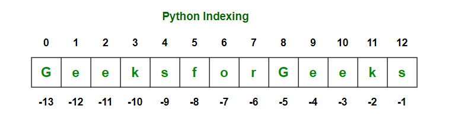

## Slicing

- In Python it is possible to access a section of items from the list using the slicing operator ‘ : ‘ , not just a single item. 

```python
Syntax:
Mylist[ start : stop : step ]
```

- **Slicing** is indexing syntax that extracts a portion from a list. 
- If a is a list, then a[m:n] returns the portion of a:
    - Starting with postion m
    - Up to but not including n
    - Negative indexing can also be used
- It is more applicable for strings.
- Python uses default step as 1, sometimes no need to tell/put it
- Also default stopping index is the final, still no need to tell for this kind a purpose

```python
my_list = ['apple', 'banana', 'cherry', 'date']

print(my_list[1:3]) # output: ['banana', 'cherry']
print(my_list[:2]) # output: ['apple', 'banana']
print(my_list[2:]) # output: ['cherry', 'date']
```

```python
sentence = "The quick brown fox jumps over the lazy dog"

first_word = sentence[:3]
second_word = sentence[4:9]
third_word = sentence[10:15]

print(first_word) # output: "The"
print(second_word) # output: "quick"
print(third_word) # output: "brown"
```

```python
numbers = [1, 2, 3, 4, 5, 6, 7, 8, 9]

odd_numbers = numbers[::2]
even_numbers = numbers[1::2]

print(odd_numbers) # output: [1, 3, 5, 7, 9]
print(even_numbers) # output: [2, 4, 6, 8]
```

```python
numbers = [1, 2, 3, 4, 5, 6, 7, 8, 9]
numbers[1:4] = [10, 20, 30]

print(numbers) # output: [1, 10, 20, 30, 5, 6, 7, 8, 9]
```

## User Input handling

- On python there are **2 types** of inputs

1. By input function
2. By Arguments

1. **input functions**

- Syntax:

```python
var = input("Text you like to display: ")
```

- Will accept the input and stores on variable
- You can change the input type to *int(), float(), eval(), str()*….

```python
number = int(input("Enter number: "))
print(type(number))  # Output = <class int>
```

2. **Arguments**

- This help us to get the input from the command lines
- Shell: 	python gtst.py arg1 arg2 arg3
- Syntax:

```python
import sys
name = sys.argv[1]
print(f"Hello {name}!")
```

- Have You seen the output? 
- We entered -> Aman
- Output: Hello Aman!

# Operators

- Operators are special symbols that perform operations on variables and values.
- There are lots of operators type on python:
    1. Arithmetic operators
    2. Assignment Operators
    3. Comparison Operators
    4. Logical Operators
    5. Bitwise Operators
    6. Special Operators

1. Arithmetic Operators

- They are a simple math operations.
- Inputs have to be in int, eval, float only
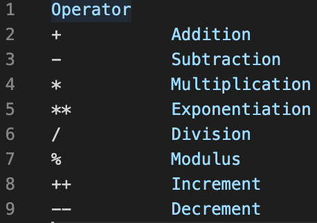
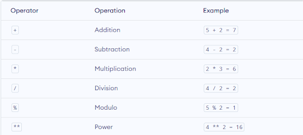

2. Assignment Operators

- Assignment operators are used to assign values to variables
- You do the arithmetic operators 1st , then the equal sign.
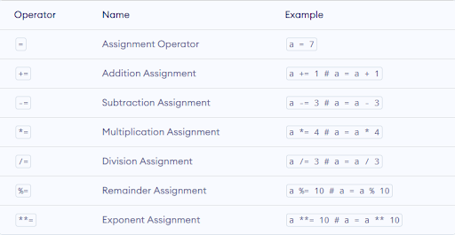

3. Comparison operators

- Used to compare to variables and return **Boolean** result
- **Boolean** means either  TRUE or FALSE.
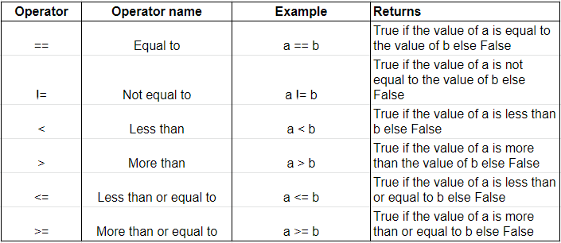

4. Logical Operators

- They are used to check if an expression is TRUE or FALSE.
- They use Truth tables to compare.
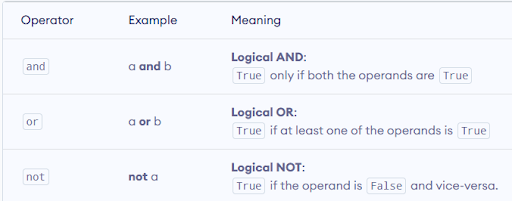

5. Bitwise Operators

- Computers Work with Binary.
- On our computer everything have a binary value.  ( also called bit) 
- On python there is a keyword called bin(YourDecimal) this helps to Show you the binary value of YourDecimal
    - True have a value of 1
    - False have a value of 0
- **Bitwise Operators** Used to do math(Logical operations) on The binary value of The expression. 
- There are 
    1. Compliment( Not)(~)
    2. And ( & )
    3. Or ( | )
    4. Xor ( ^ )
    5. Left Shift (<<)
    6. Right shift (>>)
- If you work on *Cryptography* on hacking this is must!

1. Complement( NOT )( ~ )

- It will convert the first value to binary  and it will reverse each bit then converts to decimal.
- In simple math, it will add 1 to the number and then makes it negative.

2. And( & )

- You can add 0 before the binary of any number if it is not 4 digit binary
- bin(7)  -> 111  , but we can do 0111 too.

3. OR ( | )

- SAME AS AND but the logic operator will be changed.

4. XOR ( ^ )

- It is like and , or but the difference is the logic here is
- If they are same = 0     *1^1 = 0    ,    0^0 = 0*
- If they are different = 1     *1^0  =  1     ,   0^1  = 1*

5. Left Shift ( << ) and Right shift ( >> )

- Shift the zeros or numbers before or after the dotes.

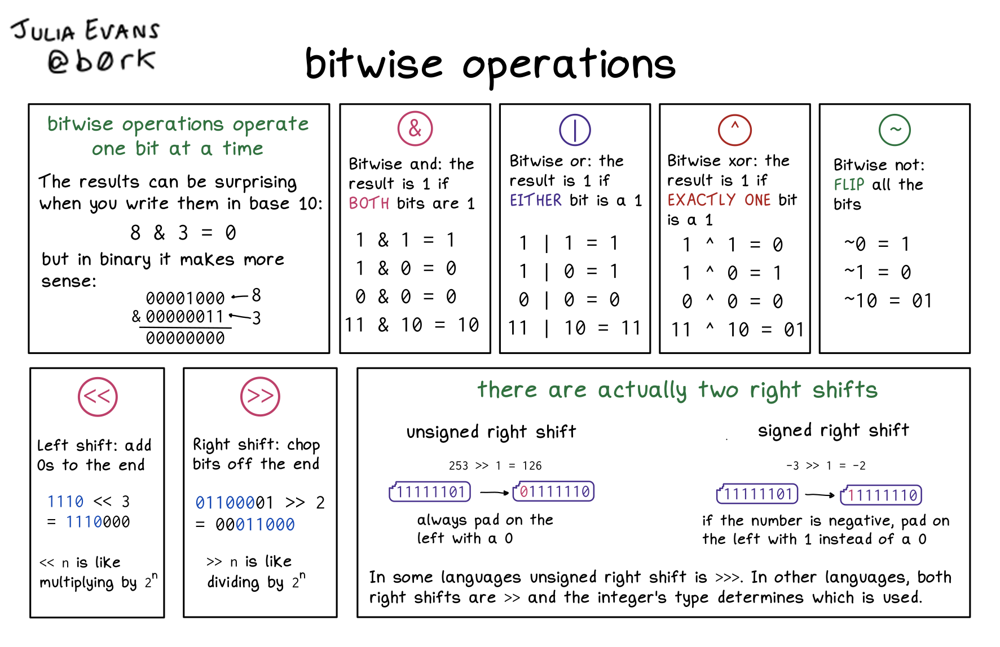
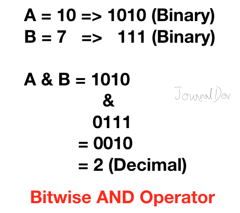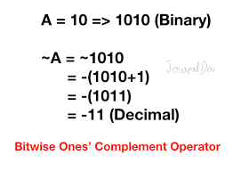
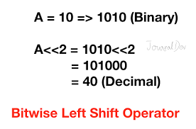

---

## indentations

- Are Just a WhiteSpace which python uses for some of its function. If there is no proper indentation error then you are doomed.

## If-else conditions

-In computer programming, we use the if statement to run a block code only when a certain condition is True.
- For example, assigning grades (A, B, C) based on marks obtained by a student.
    - if the percentage is above 90, assign grade A
    - if the percentage is above 75, assign grade B
    - if the percentage is above 65, assign grade C
- In Python, there are three forms of the if...else statement.
    1. if statement
    2. if...else statement
    3. if...elif...else statement

1. If statement

- The if statement evaluates condition.
- If condition is evaluated to True, the code inside the body of if is executed.
- If condition is evaluated to False, the code inside the body of if is skipped.
- **Syntax:**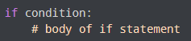

2. If...else statement

- An if statement can have an optional else clause.
- **The syntax of if...else statement is:**
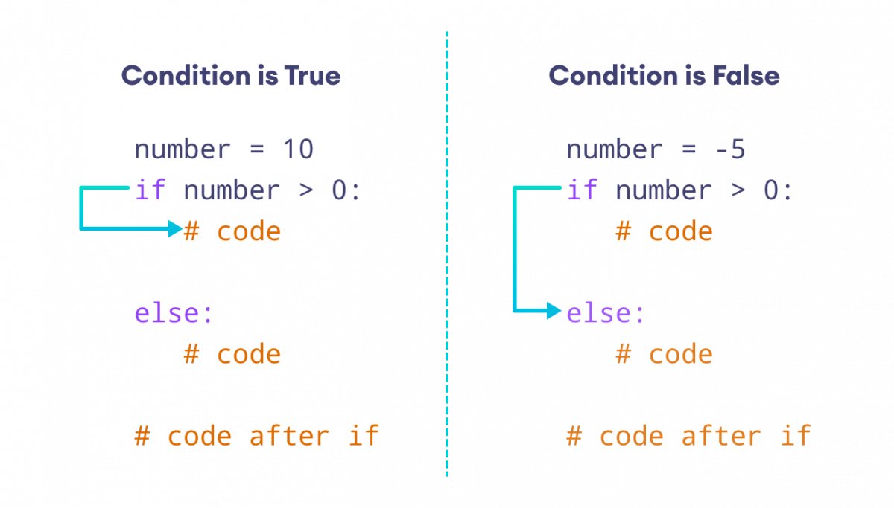

3. if...elif...else statement

- If condition1 evaluates to True, code block 1 is executed.
- If condition1 evaluates to False, then condition2 is evaluated.
- If condition2 is True, code block 2 is executed.
- If condition2 is False, code block 3 is executed.

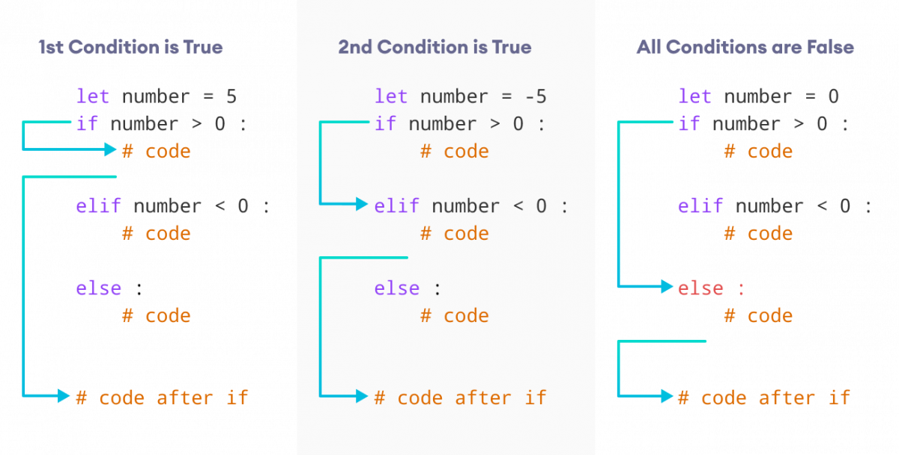

4. Nested if statements

- We can also use an if statement inside of an if statement. This is known as a nested if statement.
- Here two requirements have to be true to run the body of condition2.

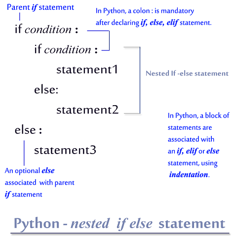

# Logical Errors ( Exceptions)

- Errors that occur at runtime (after passing the syntax test) are called **exceptions** or **logical errors**.
- For instance, they occur when we
    - try to call an index that is greater than the list have causes ( IndexError )
    - try to divide a number by zero (ZeroDivisionError)
    - When you have error on your syntax (NameError) and so on.
- So specially when errors occur on runtime this causes a huge damage on our program so we have to handle it.

## Error handling

- For handling errors we use try…except blocks.
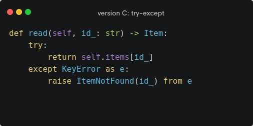

# Python Loops

- In computer programming, loops are used to repeat a **block of code**.
- For example, if we want to show a message 100 times, then we can use a loop. And print(100) It's just a simple example; you can achieve much more with loops.
- There are 2 types of loops in Python:
    1. For Loop
    2. While Loop

1. For loop

- In Python, the for loop is used to run a block of code for a certain number of times. It is used to iterate over any sequences such as list, tuple, string, etc.
- **Syntax:**

```python
for val in sequence:
    #contents
```

- *Sequence* is a list,tuple,string or range.
- *Val* is a variable which will hold the iteration from the sequence.

## Range keyword

- A *range* is series of values between two numeric intervals.**range(size)**

```python
for val in range(size):
    #contents
```

## len keyword

- A *len* is used to show the length of a sequence may be list,tuple or staffing.**len(list)**

```python
a = [1,2,3,4,5,"hello"]

if val in range(len(a)):
    print(val)
# output=0,1,2,3,4,5
```

2. While loops

- Python while loop is used to run a specific code until a certain condition is met.
- **Syntax:**

```python
while condition:
    #body of while loop
```
- You can do infinite loops.

```python
while True:
    # body of the loop
```

### Difference between for and while

- The for loop is usually used when the number of iterations is known.
- And while loop is usually used when the number of iterations are unknown. When we have condition.
- Example: 
    - If you have a case that wanted to check level of a user and displays “ you have passed {n}th level” n is sequence. Until the user level and the class level is equal. What do u do?

```python
CL=0
FL=5
while Cl <= FL:
    print('you have passed the level', CL)
    CL += 1
print('Levels end')
```

- **For loops:** ends when the iterable is finished.
- **While loops:** end when the condition is false.

### Break

- **Break** used to exit from an infinite loop.
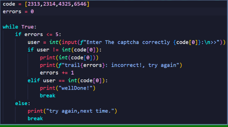
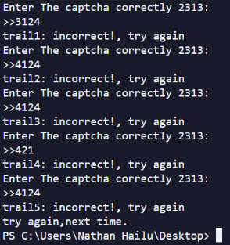