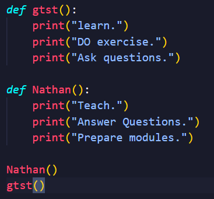
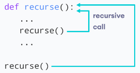
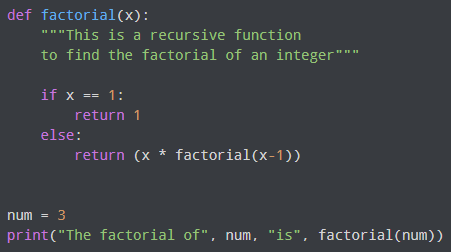
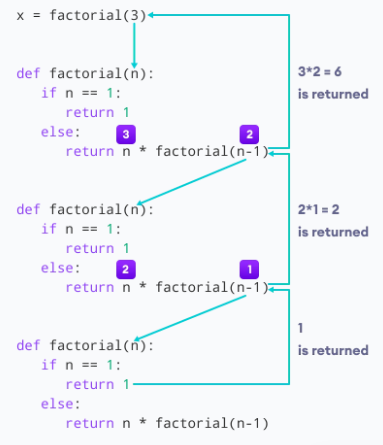
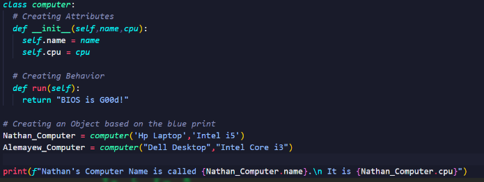
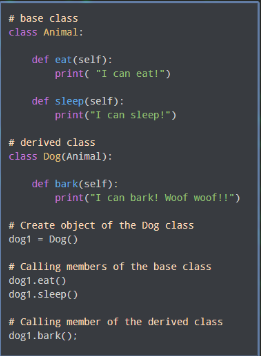
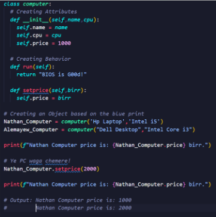

# Functions

- A function is a block of code that performs a specific task.
- Suppose, you need to create a program to create a blue circle.
- You can create two functions to solve this problem:
    - A function that create a circle function
    - A function that create a color function
- Dividing a complex problem into smaller chunks makes our program easy to understand and reuse.

## Types of function

- There are two types of function in Python programming:
    1. **Standard library functions** - These are built-in functions in Python that are available to use.
        - Almost all keywords are functions
        - print(),len(),input()....
    2. **User-defined functions** - We can create our own functions based on our requirements.

### Creating Functions

- syntax

```python
def function_name(arguments):
    # function body

function_name()
```

- It have body like if else statements also have body.
- Functions have to be called to word.
- We have 2 functions
    1. gtst
    2. Nathan
- Both do different tasks.
- We have called their name so they are on the output.


## Function Arguments

- They are used to take value while calling and insert it inside the function.

```python
# Function with two argument
def add(num1,num2):
    sum = num1 + num2
    print('The sum is', sum) 
    
    add(4,5)   # Output:> The sum is 9.
```

## Return statement

- A Python function may or may not return a value.
- If we want our function to return some value to a function call, we use the ‘return’ statement.

```python
def add():
    # Body of the function
    return sum
    # In this case there is no output.
```

```python
def add(num1,num2):
    return num1 + num2

print(add(2,3))     # Output:> 5
```

```python
def add(num1,num2):
    return num1 + num2

sum = add(2,3)
print(sum)          # Output:> 5
```

- As I told you every things are functions on python
    - So print() is function also input() is len(), everything
    - When we do print(hello) we are calling the function and giving it an argument.
- You can give default values too.

## Recursion

- **Recursion** is process of defining something in terms of itself.
- In Python, we know that a function can call other functions. It is even possible for the function to call itself. These types of construct are termed as recursive functions.


- So, This helps to call the factorial in.


### Advantages of Recursion

- Recursive functions make the code look clean and elegant.
- A complex task can be broken down into simpler sub-problems using recursion.
- Sequence generation is easier with recursion than using some nested iteration.

### Disadvantage of Recursion

- Sometimes the logic behind recursion is hard to follow through.
- Recursive calls are expensive (inefficient) as they take up a lot of memory and time.
- Recursive functions are hard to debug.

# Anonymous / lambda Function

- If function doesn’t have name it is called **lambda function / Anonymous**.
- If you have 1 line code to return you don’t need to **def** a function.
- **lambda function** is a special type of function without the function name.
- Syntax: 

```python
lambda arguments : expression
```

- We use **lambda** keyword instead of **def**.
- *Examples*

```python
# Function

def greet():
    return "hello world"
print(greet())

# lambda

greet = lambda : print("hello world")

```

```python
# Function

def numbers(a,b):
    return a+b
print(numbers(2,3))     # Output:> 5

# Lambda

numbers = lambda a,b : a+b
print(numbers(2,3))     # Output:> 5
```

## Function takers function

- Filter, map & reduce takes a function as an argument.


### Filter Function

- Filters are used to filter or search some function from sequences.

```python
# Functions 
def even(n):
    return n%2==0

nums=[3,2,6,8,4,6,2,91]

evens=list(filter(even, nums))

print(evens)        # Output:> [2,6,8,4,6,2]

# Lambda

nums=[3,2,6,8,4,6,2,91]

evens=list(filter(lambda n:n%2==0, nums))

print(evens)        # Output:> [2,6,8,4,6,2]
```

### Map function

- Used to do some operations on Sequences.


```python
# Function
def doub(n):
    return n*2

nums=[3,2,6,8,4,6,2,91]
doubles=list(map(doub, nums))
print(doubles)                  # Output:> [6,4,12,16,8,12,4,182]

# Lambda

nums=[3,2,6,8,4,6,2,91]
doubles=list(map(lambda n:n*2, nums))
print(doubles)                  # Output:> [6,4,12,16,8,12,4,182]

```

- using map function and filter function.
- If you want to do a doubling equations on a list of numbers.

```python
# using Both function in lambda
nums=[3,2,6,8,4,6,2,91]

evens=list(filter(lambda n:n%2==0, nums))
doubles=list(map(lambda n:n*2, evens))
print(doubles)                  # Output:>  [6,4,12,16,8,12,4,182]
```

## The Append Keyword

- This Keyword used to add new element to an existing list.
- Syntax ===> **mylist.append(“New Element”)**

# Object-Oriented Programming(OOP)

- Python is an object oriented programming, This means mores things in python are objects.
- **Objects** are anything which can have action and name.
- Objects have **attributes(properties)** and **methods(action or functions)**
- *Example*:  My Computer is an object because, it have..
    1. **Attribute**: name,size,CPU,ram…
    2. **Behavior**: Running games, playing music, displaying texts…

## Python class

- **Class** is simply a place where we create our Object’s attribute and behavior, It is like a template
- Class is a blueprint for that object.
- **Syntax:**

```python
class Computer:
    
    # Creating Attributes
    name=" "
    cpu=" "
```

- After you create the Blueprint, now you can create the objects based on your class
- On the above example we created Class computer and gave it an attributes of name,cpu.
- Conventionally Class Names Start with **capital letter**.

### Giving Behaviors == Creating Methods

- Functions are called methods on OOP
- Syntax:====> **classname .method(object)**

```python
class Computer:
    
    # Creating Attributes
    name=" "
    cpu=" "

    # Creating Behaviors
    def run(self):
        return "Bios is good!"

# Creating an object based on the blue print
        Aman_computer = Computer()
        Aman_computer.name = "Toshiba"
        Aman_computer.cpu = "Intel core i3"
    print(f"Running: {Computer.run(Aman_computer)}")
```

# Python Constructors 

- Earlier we assigned a default value to a class attribute,
- However, we can also initialize values using the constructors.
- Here, __init__() is the constructor method that is called whenever a new object of that class is instantiated.
- The constructor above initializes the value of the name attribute. We have used the **self.name** to refer to the name attribute of the bike1 object. -> it is like 2 variables 1 is from outside(name) the class and the another is from inside(**self.name**) the class.
- If we use a constructor to initialize values inside a class, we need to pass the corresponding value during the object creation of the class.

```python
class Bike:

    # constructer function
    def _init_(self, name = ""):
        self.name = name

bike1 = Bike()
bike1 = Bike("Mountain Bike")
```



## Python Inheritance

- Is a way of creating new class with some properties of existing class.
- *Syntax:* ====> **class newclass(oldclass)**


## Python Encapsulation

- Encapsulation is Feature of OOP, That refers to bundling of attributes and methods inside a single class.
- Encapsulation allows for better control and protection of the data, ensuring that it is accessed and modified only through specified methods.


# Package installing

- We use pip to install tools so, on terminal
	- **pip install packagename**

## Package using

- On python, there are a lot of packages to use them, we simply **import packagename**.
- Each packages have their own classes and methods so we have to do more studies about those packages.
- From now on when you want to learn website dev with python it is just learning the package. - **Django,flask,panda,numpy**.

```python
import <pakagename>
```